# Daiyly — Complete App Flows

All user flows with Mermaid diagrams, API endpoints, request/response shapes, guest vs authenticated differences, offline behavior, and library internals.

**Screens**: 17 files total (including 2 layout files)
**Last updated**: 2026-02-25 (full audit: streak endpoints, auth layout redirect, providers chain, dark mode architecture, all API paths verified)

---

## Table of Contents

- [Navigation Architecture](#navigation-architecture)
- [Root Layout & Decision Tree](#root-layout--decision-tree)
- [Auth Flow (Login / Register / Apple)](#auth-flow)
- [Guest Flow](#guest-flow)
- [Guest → Auth Migration](#guest--auth-migration)
- [Home / Dashboard Flow](#home-flow)
- [New Entry Flow](#new-entry-flow)
- [Draft Auto-Save System](#draft-auto-save-system)
- [Entry Detail Flow (View / Edit / Delete)](#entry-detail-flow)
- [History Flow](#history-flow)
- [Insights Flow](#insights-flow)
- [Search Flow](#search-flow)
- [Sharing Flow](#sharing-flow)
- [Paywall Flow](#paywall-flow)
- [Settings Flow](#settings-flow)
- [Notification Center Flow](#notification-center-flow)
- [Biometric Lock](#biometric-lock)
- [Offline Cache System](#offline-cache-system)
- [Token Refresh & Auth Expiry](#token-refresh--auth-expiry)
- [API Reference (Full)](#api-reference)
- [Data Types](#data-types)
- [Guest vs Authenticated Matrix](#guest-vs-authenticated-matrix)
- [AsyncStorage Keys](#asyncstorage-keys)
- [Library Files Reference](#library-files-reference)
- [Force Update Mechanism](#force-update-mechanism)
- [Deep Linking](#deep-linking)
- [Store Review Prompts](#store-review-prompts)
- [Legal Compliance (Auth Screens)](#legal-compliance-auth-screens)
- [Subscription Cancel Warning](#subscription-cancel-warning)
- [Apple Token Revocation](#apple-token-revocation-on-account-delete)
- [Notification OS Permission Sync](#os-permission-sync)
- [Onboarding Flow](#onboarding-flow)
- [Internationalization (i18n)](#internationalization-i18n)
- [Components Reference](#components-reference)
- [Types Reference](#types-reference)

---

## Navigation Architecture

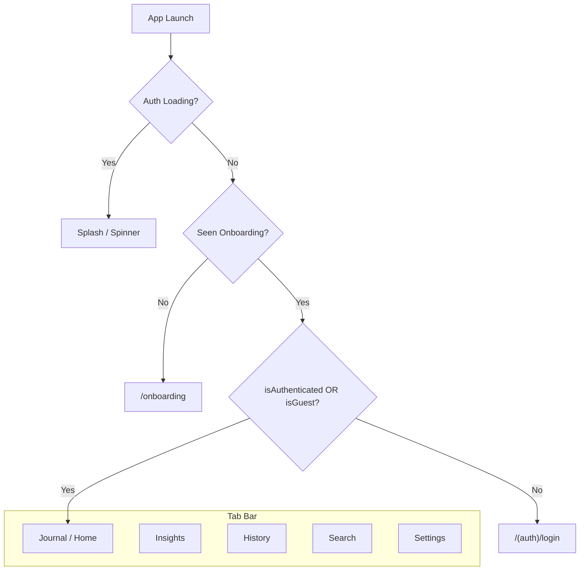
```mermaid
graph TD
    A[App Launch] --> B{Auth Loading?}
    B -->|Yes| C[Splash / Spinner]
    B -->|No| D{Seen Onboarding?}
    D -->|No| E["/onboarding"]
    D -->|Yes| F{"isAuthenticated OR isGuest?"}
    F -->|Yes| G["/(protected)/home"]
    F -->|No| H["/(auth)/login"]

    subgraph Tab Bar
        G["Journal / Home"]
        I["Insights"]
        J["History"]
        K["Search"]
        L["Settings"]
    end
```

### Tab Structure (5 Tabs)

| Tab | Route | Icon (inactive) | Icon (active) |
|-----|-------|-----------------|---------------|
| Journal | `/(protected)/home` | `book-outline` | `book` |
| Insights | `/(protected)/insights` | `analytics-outline` | `analytics` |
| History | `/(protected)/history` | `time-outline` | `time` |
| Search | `/(protected)/search` | `search-outline` | `search` |
| Settings | `/(protected)/settings` | `settings-outline` | `settings` |

### Hidden Routes (tab bar hidden)

`entry/[id]`, `new-entry`, `paywall`, `notification-center`, `sharing`

### All Screen Files

| # | File | Purpose |
|---|------|---------|
| 1 | `app/_layout.tsx` | Root Layout — providers, i18n, API config, force update |
| 2 | `app/index.tsx` | Decision Tree — onboarding/auth/guest routing |
| 3 | `app/onboarding.tsx` | 3-page horizontal onboarding carousel |
| 4 | `app/(auth)/_layout.tsx` | Auth guard — redirects to home if already authenticated/guest |
| 5 | `app/(auth)/login.tsx` | Email/password login + Apple Sign-In + guest |
| 6 | `app/(auth)/register.tsx` | Email/password registration |
| 7 | `app/(protected)/_layout.tsx` | Tab Layout + Biometric lock + SubscriptionProvider |
| 8 | `app/(protected)/home.tsx` | Dashboard — entries, streak, quick mood, offline cache |
| 9 | `app/(protected)/new-entry.tsx` | Create Entry — draft auto-save, entry_date |
| 10 | `app/(protected)/entry/[id].tsx` | View / Edit / Delete Entry — guest guards |
| 11 | `app/(protected)/history.tsx` | History — paginated, mood filter, offline cache |
| 12 | `app/(protected)/insights.tsx` | Insights + AI Report — premium gating, offline cache |
| 13 | `app/(protected)/search.tsx` | Full-text Search — offline fallback |
| 14 | `app/(protected)/sharing.tsx` | Share Cards (entry/weekly/streak) via PNG |
| 15 | `app/(protected)/paywall.tsx` | Paywall — RevenueCat + custom fallback |
| 16 | `app/(protected)/settings.tsx` | Settings — theme, biometric, export, account |
| 17 | `app/(protected)/notification-center.tsx` | Notification preferences + generated items |

---

## Root Layout & Decision Tree

### `app/_layout.tsx`

Providers chain: `ErrorBoundary` > `SafeAreaProvider` > `ThemeProvider` > `AuthProvider`

On mount (async init):
1. `await refreshApiBaseUrl()` — `GET /api/config` for remote URL override + captures `min_app_version`
2. `initLanguage()` — i18n initialization from stored language preference
3. Force update check — compares app version against `min_app_version` from config, checks `wasRecentlyDismissed()`, shows `ForceUpdateModal` if outdated (6-hour throttle)

Components rendered:
- `<ThemedApp />` — wraps `<Slot />` with StatusBar (uses `isDark` from ThemeContext)
- `<ForceUpdateModal visible={forceUpdate} onDismiss={() => setForceUpdate(false)} />` — full-screen modal (outside AuthProvider, renders even before auth loads)

Routing: Uses `<Slot />` (not `<Stack />`). Child routes (`index.tsx`, `onboarding.tsx`, `(auth)/*`, `(protected)/*`) are rendered as flat slots. Navigation animations are handled by each group's own layout.

### `app/(auth)/_layout.tsx`

Auth-aware redirect guard. When `isAuthenticated` or `isGuest` becomes true (after login/register/Apple/guest), immediately returns `<Redirect href="/(protected)/home" />`. Otherwise renders `<Slot />` for login/register screens.

This is the primary mechanism that navigates users to the home screen after successful authentication — the auth screens themselves do NOT call `router.replace()`.

### `app/index.tsx`

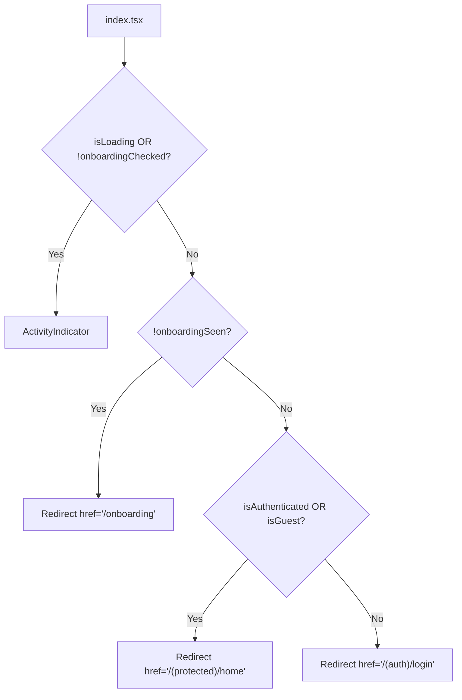
```mermaid
graph TD
    A["index.tsx"] --> B{isLoading OR !onboardingChecked?}
    B -->|Yes| C[ActivityIndicator]
    B -->|No| D{!onboardingSeen?}
    D -->|Yes| E["Redirect href='/onboarding'"]
    D -->|No| F{"isAuthenticated OR isGuest?"}
    F -->|Yes| G["Redirect href='/(protected)/home'"]
    F -->|No| H["Redirect href='/(auth)/login'"]
```

Uses `<Redirect>` component (not `router.replace`). This only fires on initial load or when navigating back to `/`.

State: `onboardingChecked` (bool), `onboardingSeen` (bool from AsyncStorage)

### `app/onboarding.tsx`

3-page horizontal scroll intro with animated transitions.

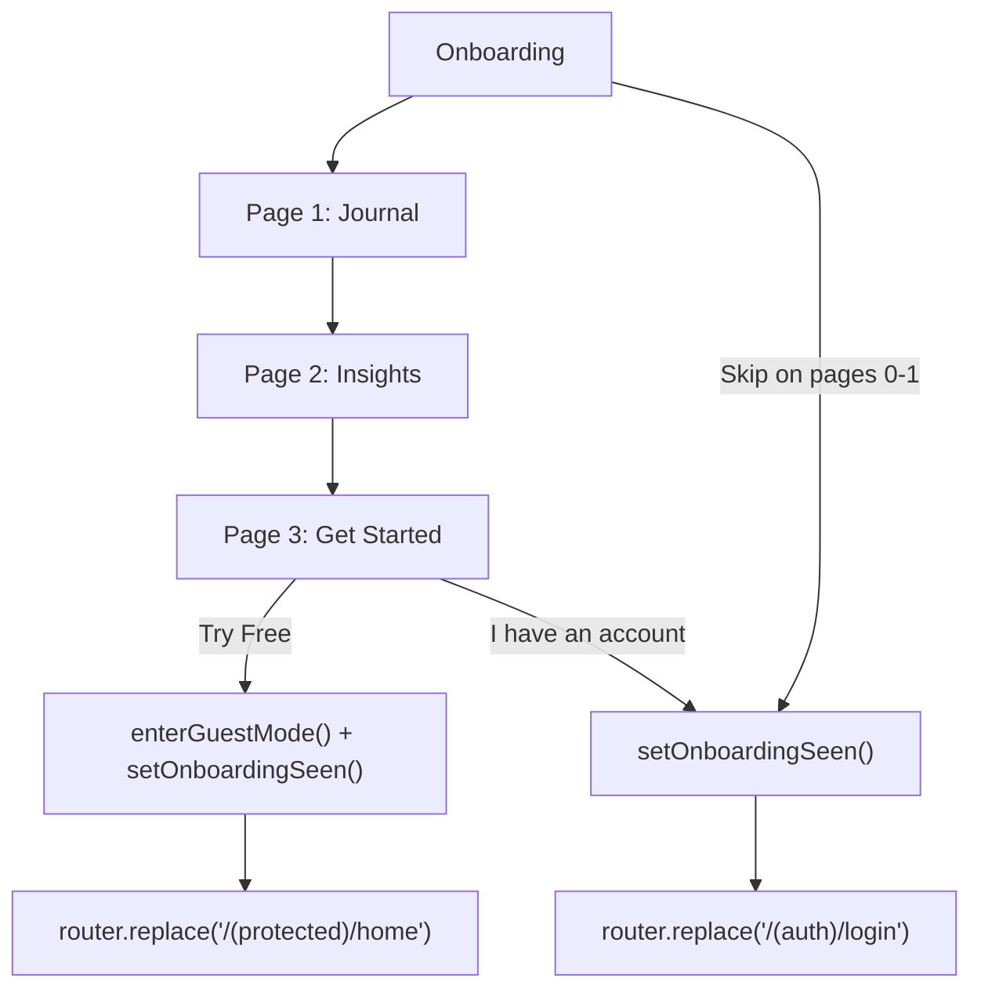
```mermaid
graph TD
    A["Onboarding"] --> B[Page 1: Journal]
    B --> C[Page 2: Insights]
    C --> D[Page 3: Get Started]

    D -->|"Try Free"| E["enterGuestMode() + setOnboardingSeen()"]
    E --> F["router.replace('/(protected)/home')"]

    D -->|"I have an account"| G["setOnboardingSeen()"]
    G --> H["router.replace('/(auth)/login')"]

    A -->|"Skip" on pages 0-1| G
```

Pages: fade animation via `Animated.Value`, dot indicators, FlatList with `pagingEnabled`.

---

## Auth Flow

### `app/(auth)/login.tsx`

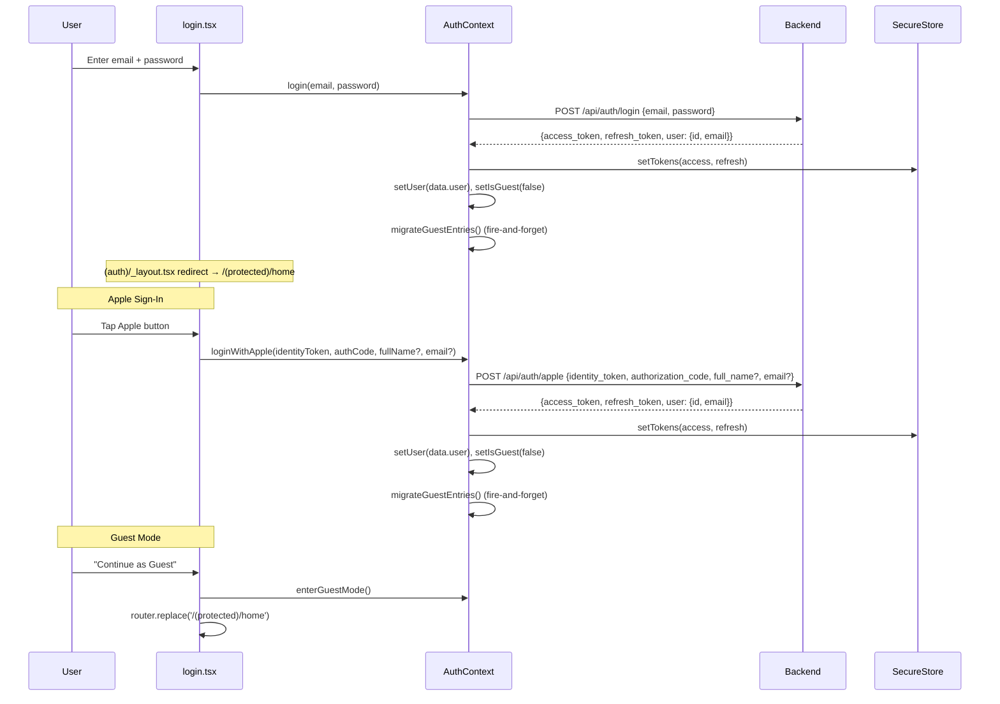
```mermaid
sequenceDiagram
    participant U as User
    participant App as login.tsx
    participant Ctx as AuthContext
    participant API as Backend
    participant SS as SecureStore

    U->>App: Enter email + password
    App->>Ctx: login(email, password)
    Ctx->>API: POST /api/auth/login {email, password}
    API-->>Ctx: {access_token, refresh_token, user: {id, email}}
    Ctx->>SS: setTokens(access, refresh)
    Ctx->>Ctx: setUser(data.user), setIsGuest(false)
    Ctx->>Ctx: migrateGuestEntries() (fire-and-forget)
    Note over App: (auth)/_layout.tsx redirect → /(protected)/home

    Note over U,App: Apple Sign-In
    U->>App: Tap Apple button
    App->>Ctx: loginWithApple(identityToken, authCode, fullName?, email?)
    Ctx->>API: POST /api/auth/apple {identity_token, authorization_code, full_name?, email?}
    API-->>Ctx: {access_token, refresh_token, user: {id, email}}
    Ctx->>SS: setTokens(access, refresh)
    Ctx->>Ctx: setUser(data.user), setIsGuest(false)
    Ctx->>Ctx: migrateGuestEntries() (fire-and-forget)

    Note over U,App: Guest Mode
    U->>App: "Continue as Guest"
    App->>Ctx: enterGuestMode()
    App->>App: router.replace('/(protected)/home')
```

**State**: `email`, `password`, `error`, `isLoading`
**Navigation**: "Sign Up" link → `/(auth)/register`

### `app/(auth)/register.tsx`

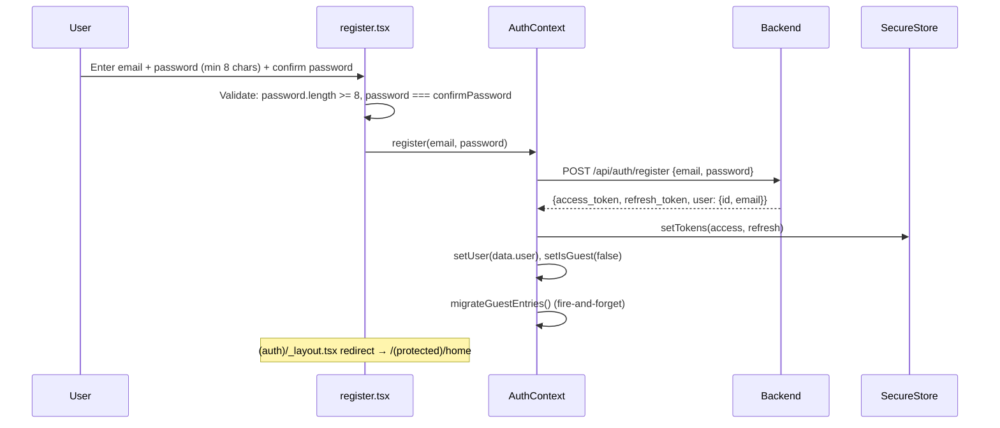
```mermaid
sequenceDiagram
    participant U as User
    participant App as register.tsx
    participant Ctx as AuthContext
    participant API as Backend
    participant SS as SecureStore

    U->>App: Enter email + password (min 8 chars) + confirm password
    App->>App: Validate: password.length >= 8, password === confirmPassword
    App->>Ctx: register(email, password)
    Ctx->>API: POST /api/auth/register {email, password}
    API-->>Ctx: {access_token, refresh_token, user: {id, email}}
    Ctx->>SS: setTokens(access, refresh)
    Ctx->>Ctx: setUser(data.user), setIsGuest(false)
    Ctx->>Ctx: migrateGuestEntries() (fire-and-forget)
    Note over App: (auth)/_layout.tsx redirect → /(protected)/home
```

**State**: `email`, `password`, `confirmPassword`, `error`, `isLoading`
**Validation**: min 8 chars, password match check
**Navigation**: "Sign In" link → `/(auth)/login`

### Session Restore (on app mount)

```mermaid
graph TD
    A["AuthContext useEffect"] --> B["getAccessToken() from SecureStore"]
    B --> C{token exists?}
    C -->|No| D["setIsLoading(false) — show login"]
    C -->|Yes| E["Decode JWT base64 payload"]
    E --> F{exp * 1000 > Date.now()?}
    F -->|Yes| G["setUser({id: sub, email}) — authenticated"]
    F -->|No| H["clearTokens() — expired"]
    E -->|Parse error| H
```

No `/api/me` call. Pure local JWT decode + expiry check.

---

## Guest Flow

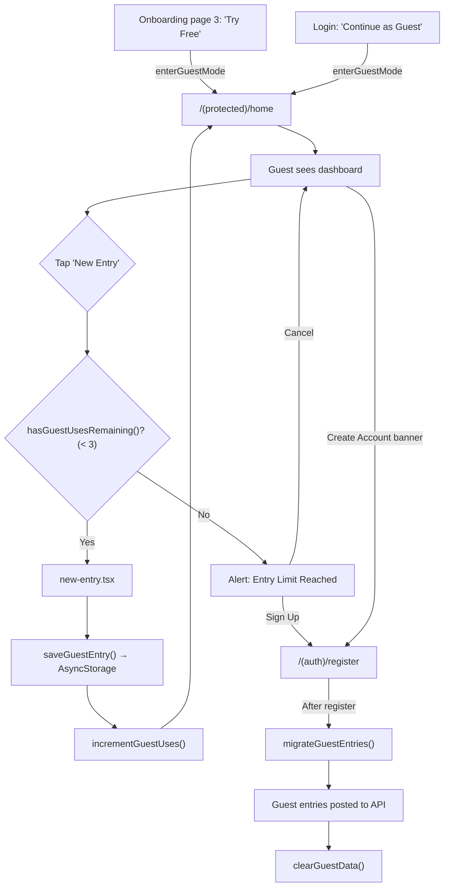
```mermaid
graph TD
    A["Onboarding page 3: 'Try Free'"] -->|enterGuestMode| B["/(protected)/home"]
    A2["Login: 'Continue as Guest'"] -->|enterGuestMode| B

    B --> C[Guest sees dashboard]
    C --> D{Tap 'New Entry'}
    D --> E{"hasGuestUsesRemaining()? (< 3)"}

    E -->|Yes| F["new-entry.tsx"]
    F --> G["saveGuestEntry() → AsyncStorage"]
    G --> H["incrementGuestUses()"]
    H --> B

    E -->|No| I["Alert: Entry Limit Reached"]
    I -->|"Sign Up"| J["/(auth)/register"]
    I -->|Cancel| C

    C -->|"Create Account" banner| J

    J -->|After register| K["migrateGuestEntries()"]
    K --> L["Guest entries posted to API"]
    L --> M["clearGuestData()"]
```

### Guest Entry Shape

```typescript
GuestEntry {
  id: string             // "guest_<timestamp>"
  mood_emoji: string     // one of 8 emojis
  mood_score: number     // 20, 40, 60, 80, or 100
  content: string
  card_color: string     // hex
  tags?: string[]        // activity tag IDs
  created_at: string     // ISO datetime
  entry_date?: string    // "YYYY-MM-DD" local date
}
```

### Guest Limits
- **Max 3 entries** (tracked via `guest_uses_count` in AsyncStorage)
- `hasGuestUsesRemaining()` → checks `count < 3`
- `incrementGuestUses()` → `count + 1`
- No streak tracking (always shows 0)
- No insights API (local computation via `computeGuestInsights()`)
- No search API (client-side `content.includes(query)`)
- No export (blocked by `requirePro()`)
- Edit/delete works locally via AsyncStorage (not API)
- Share button hidden on entry detail
- Share cards use local guest entry data (streak=0)

---

## Guest → Auth Migration

When a guest user signs up, logs in, or uses Apple Sign-In, their guest entries are automatically migrated to the authenticated account.

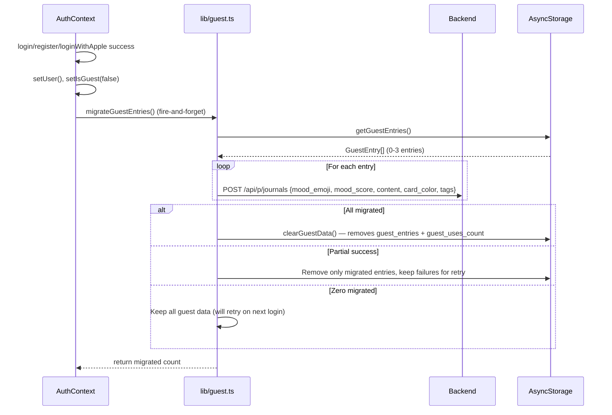
```mermaid
sequenceDiagram
    participant Ctx as AuthContext
    participant Guest as lib/guest.ts
    participant API as Backend
    participant AS as AsyncStorage

    Ctx->>Ctx: login/register/loginWithApple success
    Ctx->>Ctx: setUser(), setIsGuest(false)
    Ctx->>Guest: migrateGuestEntries() (fire-and-forget)
    Guest->>AS: getGuestEntries()
    AS-->>Guest: GuestEntry[] (0-3 entries)

    loop For each entry
        Guest->>API: POST /api/p/journals {mood_emoji, mood_score, content, card_color, tags}
    end

    alt All migrated
        Guest->>AS: clearGuestData() — removes guest_entries + guest_uses_count
    else Partial success
        Guest->>AS: Remove only migrated entries, keep failures for retry
    else Zero migrated
        Guest->>Guest: Keep all guest data (will retry on next login)
    end

    Guest-->>Ctx: return migrated count
```

**Implementation**: `lib/guest.ts:migrateGuestEntries()`
**Called from**: `contexts/AuthContext.tsx` — after `login()`, `register()`, `loginWithApple()`

### Data Safety Guarantee

Guest data is **NEVER fully deleted until ALL entries are confirmed migrated.**

```typescript
if (migratedIds.size === guestEntries.length) {
  // All entries migrated — full cleanup
  await clearGuestData();
} else if (migratedIds.size > 0) {
  // Partial success — remove only migrated entries, keep failures
  const remaining = guestEntries.filter((e) => !migratedIds.has(e.id));
  await AsyncStorage.setItem(GUEST_ENTRIES_KEY, JSON.stringify(remaining));
}
```

| Scenario | Behavior |
|----------|----------|
| 3/3 entries migrate successfully | `clearGuestData()` — full cleanup |
| 1/3 succeeds, 2/3 fail | Only the 1 success removed; 2 failures stay in AsyncStorage for retry |
| 0/3 succeed (network down) | Nothing cleared; all 3 entries remain for next trigger |
| Entry already exists (duplicate) | POST fails with 409, entry stays for retry (harmless) |

---

## Home Flow

### `app/(protected)/home.tsx`

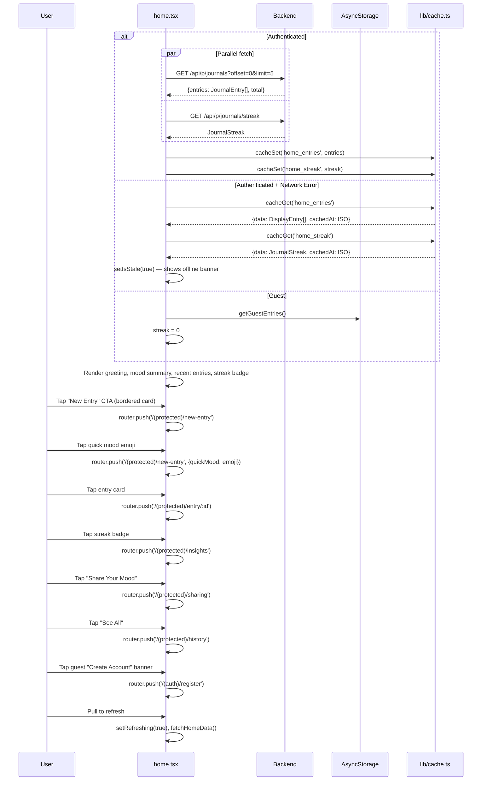
```mermaid
sequenceDiagram
    participant U as User
    participant Home as home.tsx
    participant API as Backend
    participant AS as AsyncStorage
    participant Cache as lib/cache.ts

    alt Authenticated
        par Parallel fetch
            Home->>API: GET /api/p/journals?offset=0&limit=5
            API-->>Home: {entries: JournalEntry[], total}
        and
            Home->>API: GET /api/p/journals/streak
            API-->>Home: JournalStreak
        end
        Home->>Cache: cacheSet('home_entries', entries)
        Home->>Cache: cacheSet('home_streak', streak)
    else Authenticated + Network Error
        Home->>Cache: cacheGet('home_entries')
        Cache-->>Home: {data: DisplayEntry[], cachedAt: ISO}
        Home->>Cache: cacheGet('home_streak')
        Cache-->>Home: {data: JournalStreak, cachedAt: ISO}
        Home->>Home: setIsStale(true) — shows offline banner
    else Guest
        Home->>AS: getGuestEntries()
        Home->>Home: streak = 0
    end

    Home->>Home: Render greeting, mood summary, recent entries, streak badge

    U->>Home: Tap "New Entry" CTA (bordered card)
    Home->>Home: router.push('/(protected)/new-entry')

    U->>Home: Tap quick mood emoji
    Home->>Home: router.push('/(protected)/new-entry', {quickMood: emoji})

    U->>Home: Tap entry card
    Home->>Home: router.push('/(protected)/entry/:id')

    U->>Home: Tap streak badge
    Home->>Home: router.push('/(protected)/insights')

    U->>Home: Tap "Share Your Mood"
    Home->>Home: router.push('/(protected)/sharing')

    U->>Home: Tap "See All"
    Home->>Home: router.push('/(protected)/history')

    U->>Home: Tap guest "Create Account" banner
    Home->>Home: router.push('/(auth)/register')

    U->>Home: Pull to refresh
    Home->>Home: setRefreshing(true), fetchHomeData()
```

**Offline behavior**: Shows amber "Showing cached data — pull to refresh" banner when using cache fallback.

**Data flow**: `useFocusEffect` → `fetchHomeData()` on every screen focus.

### GET /api/p/journals — Response

```json
{
  "entries": [
    {
      "id": "uuid",
      "user_id": "uuid",
      "mood_emoji": "😊",
      "mood_score": 80,
      "content": "Had a great day",
      "photo_url": "",
      "card_color": "#6366F1",
      "tags": ["work", "exercise"],
      "entry_date": "2026-02-25",
      "is_private": false,
      "created_at": "2026-02-25T10:30:00Z",
      "updated_at": "2026-02-25T10:30:00Z"
    }
  ],
  "total": 42,
  "limit": 5,
  "offset": 0
}
```

### GET /api/p/journals/streak — Response

```json
{
  "id": "uuid",
  "user_id": "uuid",
  "current_streak": 5,
  "longest_streak": 12,
  "total_entries": 42,
  "last_entry_date": "2026-02-25"
}
```

### Home UI Elements

| Element | Condition | Action |
|---------|-----------|--------|
| Greeting + emoji | Always | Time-based: morning/afternoon/evening/night |
| Streak badge | `currentStreak > 0` | Tap → insights |
| Today's mood card | Today has entry | Tap → entry detail |
| "New Entry" bordered CTA | Always | → new-entry (bg-surface-elevated, border-border) |
| Quick mood emojis | Always | Horizontal scroll, 8 emojis → new-entry with quickMood |
| "Share Your Mood" card | `entries.length > 0` | → sharing |
| Guest "Create Account" | `isGuest` | → register |
| Offline banner | `isStale` | Amber, pull to refresh hint |
| Recent entries list | `entries.length > 0` | Tap → entry detail |

---

## New Entry Flow

### `app/(protected)/new-entry.tsx`

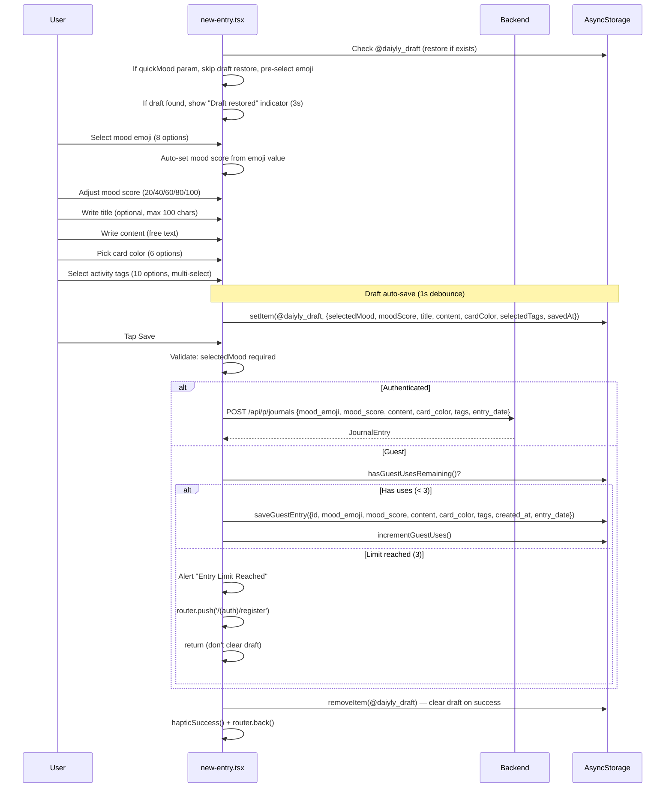
```mermaid
sequenceDiagram
    participant U as User
    participant NE as new-entry.tsx
    participant API as Backend
    participant AS as AsyncStorage

    NE->>AS: Check @daiyly_draft (restore if exists)
    NE->>NE: If quickMood param, skip draft restore, pre-select emoji
    NE->>NE: If draft found, show "Draft restored" indicator (3s)

    U->>NE: Select mood emoji (8 options)
    NE->>NE: Auto-set mood score from emoji value
    U->>NE: Adjust mood score (20/40/60/80/100)
    U->>NE: Write title (optional, max 100 chars)
    U->>NE: Write content (free text)
    U->>NE: Pick card color (6 options)
    U->>NE: Select activity tags (10 options, multi-select)

    Note over NE,AS: Draft auto-save (1s debounce)
    NE->>AS: setItem(@daiyly_draft, {selectedMood, moodScore, title, content, cardColor, selectedTags, savedAt})

    U->>NE: Tap Save
    NE->>NE: Validate: selectedMood required

    alt Authenticated
        NE->>API: POST /api/p/journals {mood_emoji, mood_score, content, card_color, tags, entry_date}
        API-->>NE: JournalEntry
    else Guest
        NE->>AS: hasGuestUsesRemaining()?
        alt Has uses (< 3)
            NE->>AS: saveGuestEntry({id, mood_emoji, mood_score, content, card_color, tags, created_at, entry_date})
            NE->>AS: incrementGuestUses()
        else Limit reached (3)
            NE->>NE: Alert "Entry Limit Reached"
            NE->>NE: router.push('/(auth)/register')
            NE->>NE: return (don't clear draft)
        end
    end

    NE->>AS: removeItem(@daiyly_draft) — clear draft on success
    NE->>NE: hapticSuccess() + router.back()
```

### POST /api/p/journals — Request

```json
{
  "mood_emoji": "😊",
  "mood_score": 80,
  "content": "Had a great day at work today...",
  "card_color": "#6366F1",
  "tags": ["work", "exercise"],
  "entry_date": "2026-02-25"
}
```

Note: `entry_date` is the local calendar date (`YYYY-MM-DD`) from the client's timezone, preventing timezone drift where a late-night entry gets assigned to the next day in UTC.

### POST /api/p/journals — Response

```json
{
  "id": "uuid",
  "user_id": "uuid",
  "mood_emoji": "😊",
  "mood_score": 80,
  "content": "Had a great day at work today...",
  "photo_url": "",
  "card_color": "#6366F1",
  "tags": ["work", "exercise"],
  "entry_date": "2026-02-25",
  "is_private": false,
  "created_at": "2026-02-25T10:30:00Z",
  "updated_at": "2026-02-25T10:30:00Z"
}
```

### Valid Values

**Mood Emojis (8):**

| Emoji | Label | Value | Auto Score |
|-------|-------|-------|------------|
| 😊 | Happy | `happy` | 80 |
| 😌 | Calm | `calm` | 70 |
| 😔 | Sad | `sad` | 30 |
| 😤 | Angry | `angry` | 20 |
| 😰 | Anxious | `anxious` | 40 |
| 😴 | Tired | `tired` | 40 |
| 🥳 | Excited | `excited` | 80 |
| 😐 | Neutral | `neutral` | 50 |

**Mood Scores:** `[20, 40, 60, 80, 100]`

**Card Colors:** `["#6366F1", "#8B5CF6", "#EC4899", "#EF4444", "#F97316", "#22C55E"]`

**Activity Tags:** `["work", "exercise", "social", "reading", "nature", "music", "cooking", "travel", "meditation", "family"]`

---

## Draft Auto-Save System

Prevents content loss when navigating away accidentally.

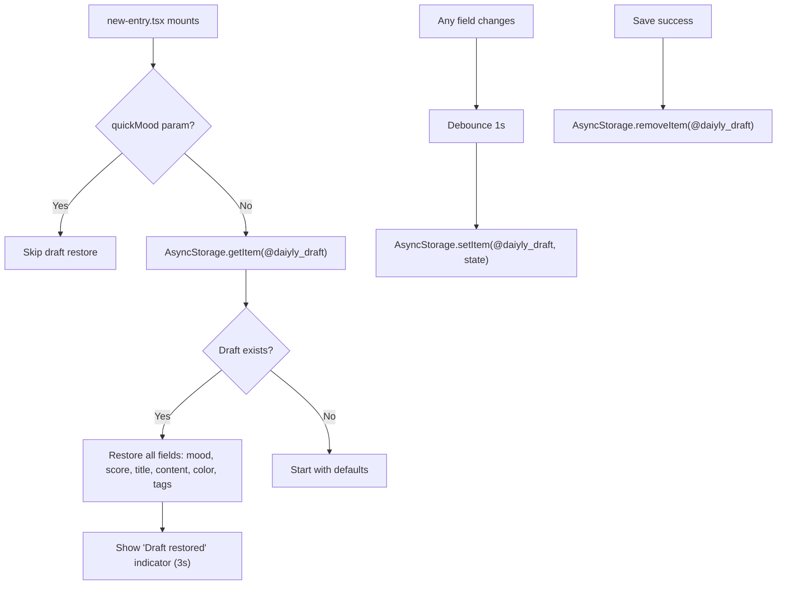
```mermaid
graph TD
    A["new-entry.tsx mounts"] --> B{quickMood param?}
    B -->|Yes| C["Skip draft restore"]
    B -->|No| D["AsyncStorage.getItem(@daiyly_draft)"]
    D --> E{Draft exists?}
    E -->|Yes| F["Restore all fields: mood, score, title, content, color, tags"]
    F --> G["Show 'Draft restored' indicator (3s)"]
    E -->|No| H["Start with defaults"]

    I["Any field changes"] --> J["Debounce 1s"]
    J --> K["AsyncStorage.setItem(@daiyly_draft, state)"]

    L["Save success"] --> M["AsyncStorage.removeItem(@daiyly_draft)"]
```

### Draft Shape

```typescript
{
  selectedMood: string | null;
  moodScore: number;
  title: string;
  content: string;
  cardColor: string;
  selectedTags: string[];
  savedAt: string;  // ISO timestamp
}
```

**Key**: `@daiyly_draft`
**Debounce**: 1 second after any field change
**Cleared**: On successful save only (not on back navigation)

---

## Entry Detail Flow

### `app/(protected)/entry/[id].tsx`

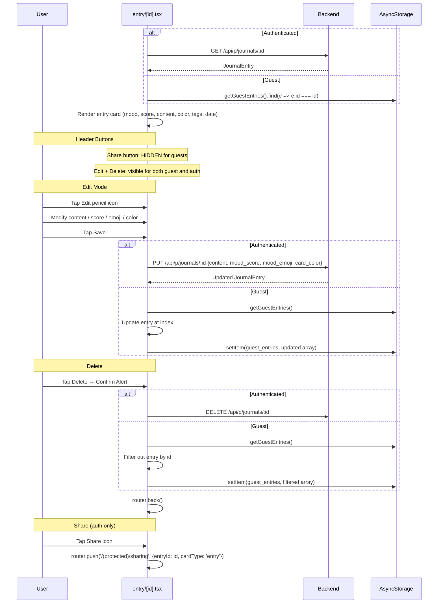
```mermaid
sequenceDiagram
    participant U as User
    participant ED as entry/[id].tsx
    participant API as Backend
    participant AS as AsyncStorage

    alt Authenticated
        ED->>API: GET /api/p/journals/:id
        API-->>ED: JournalEntry
    else Guest
        ED->>AS: getGuestEntries().find(e => e.id === id)
    end

    ED->>ED: Render entry card (mood, score, content, color, tags, date)

    Note over U,ED: Header Buttons
    Note over ED: Share button: HIDDEN for guests
    Note over ED: Edit + Delete: visible for both guest and auth

    Note over U,ED: Edit Mode
    U->>ED: Tap Edit pencil icon
    U->>ED: Modify content / score / emoji / color
    U->>ED: Tap Save

    alt Authenticated
        ED->>API: PUT /api/p/journals/:id {content, mood_score, mood_emoji, card_color}
        API-->>ED: Updated JournalEntry
    else Guest
        ED->>AS: getGuestEntries()
        ED->>ED: Update entry at index
        ED->>AS: setItem(guest_entries, updated array)
    end

    Note over U,ED: Delete
    U->>ED: Tap Delete → Confirm Alert
    alt Authenticated
        ED->>API: DELETE /api/p/journals/:id
    else Guest
        ED->>AS: getGuestEntries()
        ED->>ED: Filter out entry by id
        ED->>AS: setItem(guest_entries, filtered array)
    end
    ED->>ED: router.back()

    Note over U,ED: Share (auth only)
    U->>ED: Tap Share icon
    ED->>ED: router.push('/(protected)/sharing', {entryId: id, cardType: 'entry'})
```

### Header Buttons by Mode

| Button | Guest | Authenticated |
|--------|-------|---------------|
| Share (top bar) | Hidden | Visible |
| Edit | Visible (saves to AsyncStorage) | Visible (saves to API) |
| Delete | Visible (removes from AsyncStorage) | Visible (deletes via API) |
| "Share This Entry" CTA | Hidden | Visible |

### PUT /api/p/journals/:id — Request

```json
{
  "content": "Updated text...",
  "mood_score": 60,
  "mood_emoji": "😌",
  "card_color": "#8B5CF6"
}
```

### View Mode Elements

| Element | Description |
|---------|-------------|
| ShareableMoodCard | Preview card with emoji, score, content, color |
| Date + time | `formatDate()` + `formatTime()` from `created_at` |
| Color dot | Card color circle |
| Mood section | Large emoji + score + label (Great/Good/Okay/Low/Tough) |
| Content | Full text |
| "Edited" timestamp | If `updated_at !== created_at` |

### Edit Mode Elements

| Element | Description |
|---------|-------------|
| Content TextInput | Multiline, min-height 150px |
| Emoji picker | 10 emojis horizontal scroll |
| Score picker | 5 buttons (20/40/60/80/100) |
| Card color picker | 6 color circles |
| Cancel / Save buttons | Row at bottom |

---

## History Flow

### `app/(protected)/history.tsx`

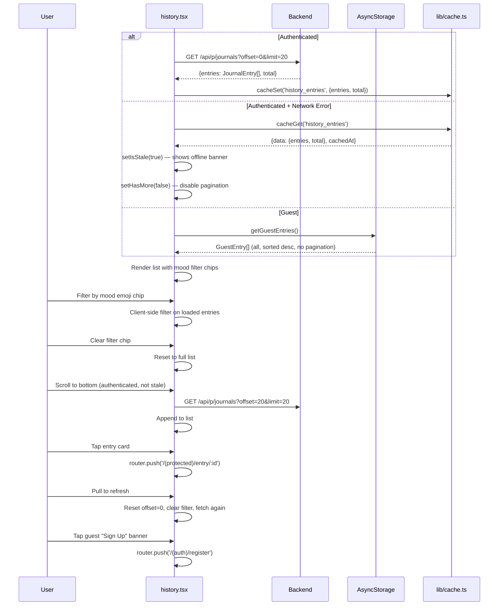
```mermaid
sequenceDiagram
    participant U as User
    participant Hist as history.tsx
    participant API as Backend
    participant AS as AsyncStorage
    participant Cache as lib/cache.ts

    alt Authenticated
        Hist->>API: GET /api/p/journals?offset=0&limit=20
        API-->>Hist: {entries: JournalEntry[], total}
        Hist->>Cache: cacheSet('history_entries', {entries, total})
    else Authenticated + Network Error
        Hist->>Cache: cacheGet('history_entries')
        Cache-->>Hist: {data: {entries, total}, cachedAt}
        Hist->>Hist: setIsStale(true) — shows offline banner
        Hist->>Hist: setHasMore(false) — disable pagination
    else Guest
        Hist->>AS: getGuestEntries()
        AS-->>Hist: GuestEntry[] (all, sorted desc, no pagination)
    end

    Hist->>Hist: Render list with mood filter chips

    U->>Hist: Filter by mood emoji chip
    Hist->>Hist: Client-side filter on loaded entries

    U->>Hist: Clear filter chip
    Hist->>Hist: Reset to full list

    U->>Hist: Scroll to bottom (authenticated, not stale)
    Hist->>API: GET /api/p/journals?offset=20&limit=20
    Hist->>Hist: Append to list

    U->>Hist: Tap entry card
    Hist->>Hist: router.push('/(protected)/entry/:id')

    U->>Hist: Pull to refresh
    Hist->>Hist: Reset offset=0, clear filter, fetch again

    U->>Hist: Tap guest "Sign Up" banner
    Hist->>Hist: router.push('/(auth)/register')
```

**Pagination**: `PAGE_SIZE = 20`, `hasMore = entries.length === PAGE_SIZE`, offset-based.

**Mood filter**: Client-side on loaded entries. Unique emojis extracted from entry list. Max 8 chips displayed.

**Guest banner**: Amber "sign up to sync" + amber "Local" badge on each entry card.

**Offline banner**: "Showing cached data — pull to refresh" when `isStale === true`.

### History Entry Card Elements

| Element | Description |
|---------|-------------|
| Left accent bar | `card_color`, 1px rounded |
| Emoji | `mood_emoji`, 20px |
| Date | `formatDate(entry_date || created_at)` |
| "Local" badge | Only for `isGuest`, amber |
| Score badge | Color-coded by score |
| Content preview | 2-line truncated |
| Time ago | `timeAgo(created_at)` |
| Chevron | Forward arrow |

---

## Insights Flow

### `app/(protected)/insights.tsx`

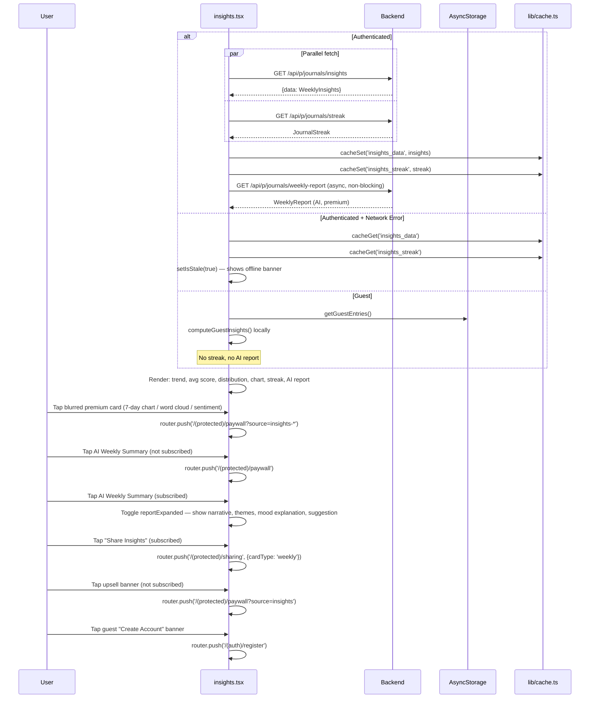
```mermaid
sequenceDiagram
    participant U as User
    participant Ins as insights.tsx
    participant API as Backend
    participant AS as AsyncStorage
    participant Cache as lib/cache.ts

    alt Authenticated
        par Parallel fetch
            Ins->>API: GET /api/p/journals/insights
            API-->>Ins: {data: WeeklyInsights}
        and
            Ins->>API: GET /api/p/journals/streak
            API-->>Ins: JournalStreak
        end
        Ins->>Cache: cacheSet('insights_data', insights)
        Ins->>Cache: cacheSet('insights_streak', streak)

        Ins->>API: GET /api/p/journals/weekly-report (async, non-blocking)
        API-->>Ins: WeeklyReport (AI, premium)
    else Authenticated + Network Error
        Ins->>Cache: cacheGet('insights_data')
        Ins->>Cache: cacheGet('insights_streak')
        Ins->>Ins: setIsStale(true) — shows offline banner
    else Guest
        Ins->>AS: getGuestEntries()
        Ins->>Ins: computeGuestInsights() locally
        Note over Ins: No streak, no AI report
    end

    Ins->>Ins: Render: trend, avg score, distribution, chart, streak, AI report

    U->>Ins: Tap blurred premium card (7-day chart / word cloud / sentiment)
    Ins->>Ins: router.push('/(protected)/paywall?source=insights-*')

    U->>Ins: Tap AI Weekly Summary (not subscribed)
    Ins->>Ins: router.push('/(protected)/paywall')

    U->>Ins: Tap AI Weekly Summary (subscribed)
    Ins->>Ins: Toggle reportExpanded — show narrative, themes, mood explanation, suggestion

    U->>Ins: Tap "Share Insights" (subscribed)
    Ins->>Ins: router.push('/(protected)/sharing', {cardType: 'weekly'})

    U->>Ins: Tap upsell banner (not subscribed)
    Ins->>Ins: router.push('/(protected)/paywall?source=insights')

    U->>Ins: Tap guest "Create Account" banner
    Ins->>Ins: router.push('/(auth)/register')
```

### GET /api/p/journals/insights — Response

```json
{
  "data": {
    "mood_trend": "improving",
    "average_mood_score": 72,
    "top_mood_emoji": "😊",
    "mood_distribution": [
      { "emoji": "😊", "count": 12, "percentage": 42.8 },
      { "emoji": "😌", "count": 8, "percentage": 28.5 }
    ],
    "daily_scores": [
      { "date": "2026-02-19", "day_name": "Wed", "score": 80 },
      { "date": "2026-02-20", "day_name": "Thu", "score": 60 }
    ],
    "total_entries": 28,
    "avg_word_count": 85,
    "total_words": 2380,
    "current_streak": 5,
    "longest_streak": 12,
    "period_start": "2026-02-19",
    "period_end": "2026-02-25"
  }
}
```

### GET /api/p/journals/weekly-report — Response (Premium, AI)

```json
{
  "narrative": "This week you showed a positive shift in mood...",
  "key_themes": ["productivity", "gratitude", "social connections"],
  "mood_explanation": "Your mood improved mid-week, likely due to...",
  "suggestion": "Consider maintaining your exercise routine...",
  "week_start": "2026-02-19",
  "stats": {
    "total_entries": 5,
    "avg_mood_score": 72,
    "top_mood_emoji": "😊"
  }
}
```

### computeGuestInsights() (local, guest mode)

Computes from AsyncStorage entries within last 7 days:
- `mood_trend`: based on average score (≥65 improving, ≥45 stable, else declining)
- `average_mood_score`: mean of all scores
- `top_mood_emoji`: most frequent emoji
- `mood_distribution`: emoji → count/percentage
- `current_streak`: consecutive days with entries from today backward
- `avg_word_count`, `total_words`: word count from content
- `daily_scores`: empty array (no daily breakdown)

### Premium Gating in Insights

| Card | Free | Subscribed |
|------|------|------------|
| Mood trend | Visible | Visible |
| Average score | Visible | Visible |
| Mood distribution | Visible | Visible |
| 7-day chart | Blurred overlay + lock icon | Visible |
| Word cloud | Blurred overlay + lock icon (3+ entries) | Visible |
| AI sentiment | Blurred overlay + lock icon (3+ entries) | Visible |
| AI weekly report | PRO badge, tap → paywall | Expandable content |
| Share insights | Opens paywall | Opens sharing |
| CTA banner | "Unlock Detailed Analytics" (dismissible) | Hidden |

### Writing Stats Card

| Stat | Icon | Source |
|------|------|--------|
| Entries | `document-text` | `insights.total_entries` |
| Avg Words | `text` | `insights.avg_word_count` |
| Total Words | `library` | `insights.total_words` |

### Streak Card Elements

| Element | Description |
|---------|-------------|
| Fire emoji + "Day N" | Current streak count |
| "Best: N" badge | Longest streak |
| Progress bar | `currentStreak / nextMilestone` |
| Milestone indicator | If at 3/7/14/21/30/50/100 |
| Total entries | Below streak info |

---

## Search Flow

### `app/(protected)/search.tsx`

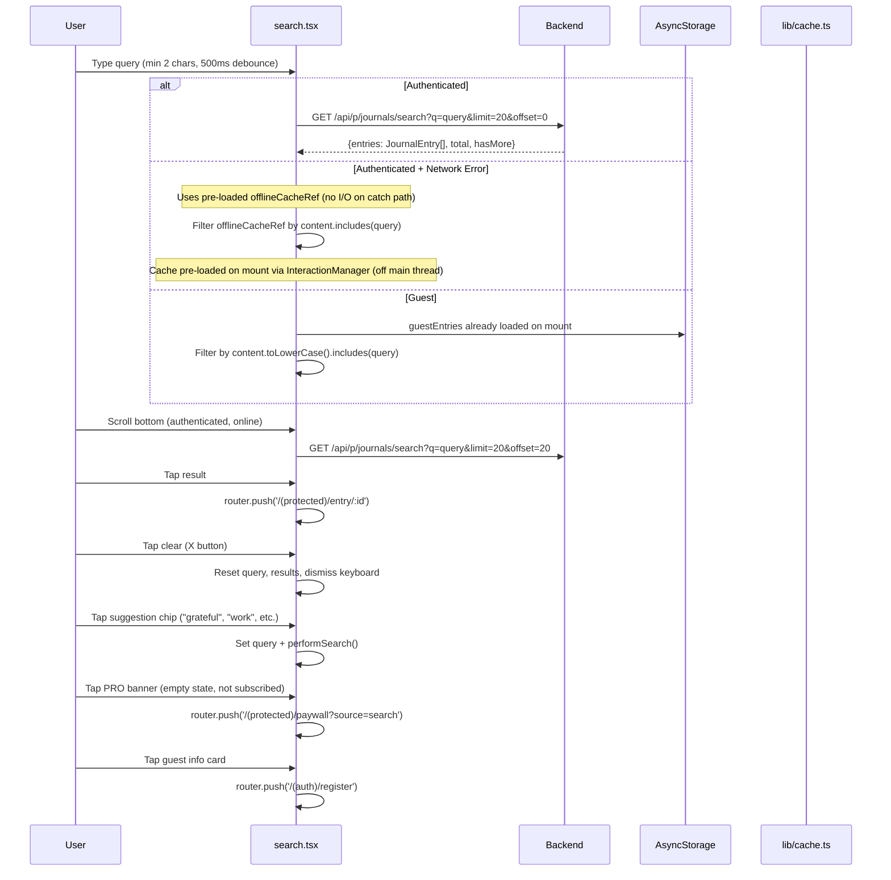
```mermaid
sequenceDiagram
    participant U as User
    participant Srch as search.tsx
    participant API as Backend
    participant AS as AsyncStorage
    participant Cache as lib/cache.ts

    U->>Srch: Type query (min 2 chars, 500ms debounce)

    alt Authenticated
        Srch->>API: GET /api/p/journals/search?q=query&limit=20&offset=0
        API-->>Srch: {entries: JournalEntry[], total, hasMore}
    else Authenticated + Network Error
        Note over Srch: Uses pre-loaded offlineCacheRef (no I/O on catch path)
        Srch->>Srch: Filter offlineCacheRef by content.includes(query)
        Note over Srch: Cache pre-loaded on mount via InteractionManager (off main thread)
    else Guest
        Srch->>AS: guestEntries already loaded on mount
        Srch->>Srch: Filter by content.toLowerCase().includes(query)
    end

    U->>Srch: Scroll bottom (authenticated, online)
    Srch->>API: GET /api/p/journals/search?q=query&limit=20&offset=20

    U->>Srch: Tap result
    Srch->>Srch: router.push('/(protected)/entry/:id')

    U->>Srch: Tap clear (X button)
    Srch->>Srch: Reset query, results, dismiss keyboard

    U->>Srch: Tap suggestion chip ("grateful", "work", etc.)
    Srch->>Srch: Set query + performSearch()

    U->>Srch: Tap PRO banner (empty state, not subscribed)
    Srch->>Srch: router.push('/(protected)/paywall?source=search')

    U->>Srch: Tap guest info card
    Srch->>Srch: router.push('/(auth)/register')
```

### GET /api/p/journals/search — Response

```json
{
  "entries": [
    {
      "id": "uuid",
      "mood_emoji": "😊",
      "mood_score": 80,
      "content": "matching text...",
      "card_color": "#6366F1",
      "tags": ["work"],
      "created_at": "2026-02-25T10:30:00Z"
    }
  ],
  "total": 5,
  "hasMore": false
}
```

**Pagination**: `PAGE_SIZE = 20`, offset-based.

**Search highlighting**: Regex-based text highlighting with yellow background on matching terms.

**Guest**: Loads all entries on mount, filters in-memory. Shows "(local)" label next to result count.

**Offline fallback**: When API fails for authenticated users, merges `history_entries` (20 entries) + `home_entries` (5 entries), deduplicates by ID, and searches locally via `content.includes(query)`. If cached results found, shows them with an amber warning banner: "Searching recent cached entries only. Connect to the internet to search all your journal entries." If no cache, shows "Failed to search" error with retry button. The `isOfflineResults` state flag controls whether the warning banner renders in the FlatList footer.

### Search UI States

| State | Condition | Content |
|-------|-----------|---------|
| Initial | `query.length < 2` | Book icon, "Search Your Journal", suggestion chips |
| Loading | `loading && results.length === 0` | Spinner + "Searching..." |
| Results | `results.length > 0` | FlatList with highlighted entries |
| No results | `results.length === 0 && !loading` | Search icon + "No entries found" |
| Error | `error && !loading` | Cloud-offline icon + error message + retry |
| Offline results | `isOfflineResults && results.length > 0` | Results + amber footer: "Searching recent cached entries only" |
| Premium banner | `!isGuest && !isSubscribed && query.length === 0` | "Upgrade for Full-Text Search" |

---

## Sharing Flow

### `app/(protected)/sharing.tsx`

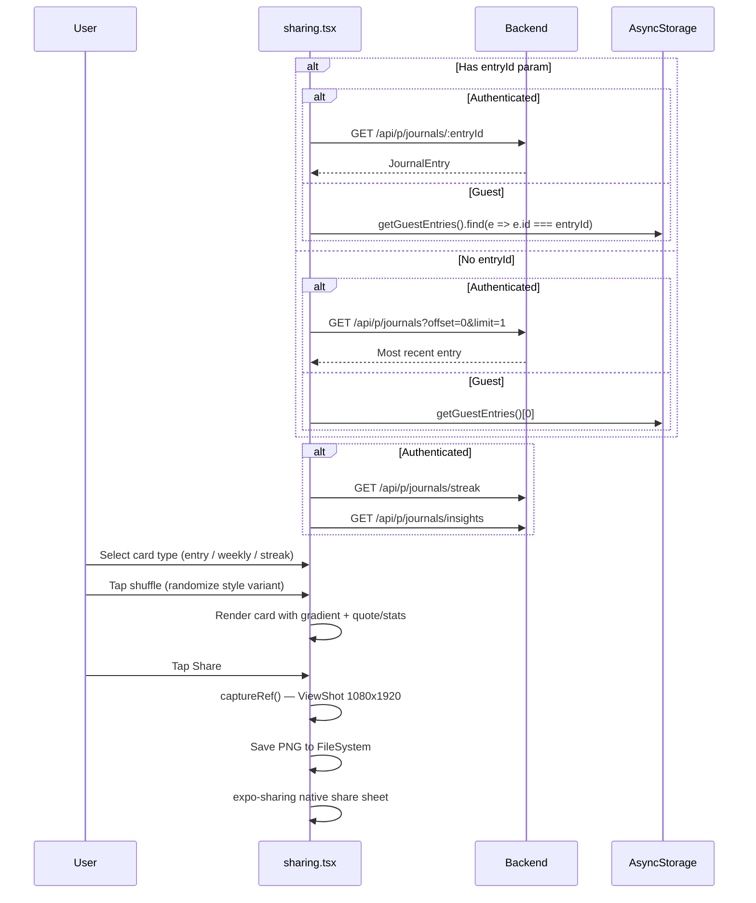
```mermaid
sequenceDiagram
    participant U as User
    participant Sh as sharing.tsx
    participant API as Backend
    participant AS as AsyncStorage

    alt Has entryId param
        alt Authenticated
            Sh->>API: GET /api/p/journals/:entryId
            API-->>Sh: JournalEntry
        else Guest
            Sh->>AS: getGuestEntries().find(e => e.id === entryId)
        end
    else No entryId
        alt Authenticated
            Sh->>API: GET /api/p/journals?offset=0&limit=1
            API-->>Sh: Most recent entry
        else Guest
            Sh->>AS: getGuestEntries()[0]
        end
    end

    alt Authenticated
        Sh->>API: GET /api/p/journals/streak
        Sh->>API: GET /api/p/journals/insights
    end

    U->>Sh: Select card type (entry / weekly / streak)
    U->>Sh: Tap shuffle (randomize style variant)
    Sh->>Sh: Render card with gradient + quote/stats

    U->>Sh: Tap Share
    Sh->>Sh: captureRef() — ViewShot 1080x1920
    Sh->>Sh: Save PNG to FileSystem
    Sh->>Sh: expo-sharing native share sheet
```

### Card Types

| Type | Content | Data Source |
|------|---------|------------|
| `entry` | Emoji + score + content snippet + inspirational quote | Single entry |
| `weekly` | Avg score + mood distribution + entry count + top emoji | Insights API |
| `streak` | Current streak + best streak + total entries | Streak API |

### Card Styles

Multiple gradient variants per card type, randomized via shuffle button. Each has different color scheme + layout.

---

## Paywall Flow

### `app/(protected)/paywall.tsx`

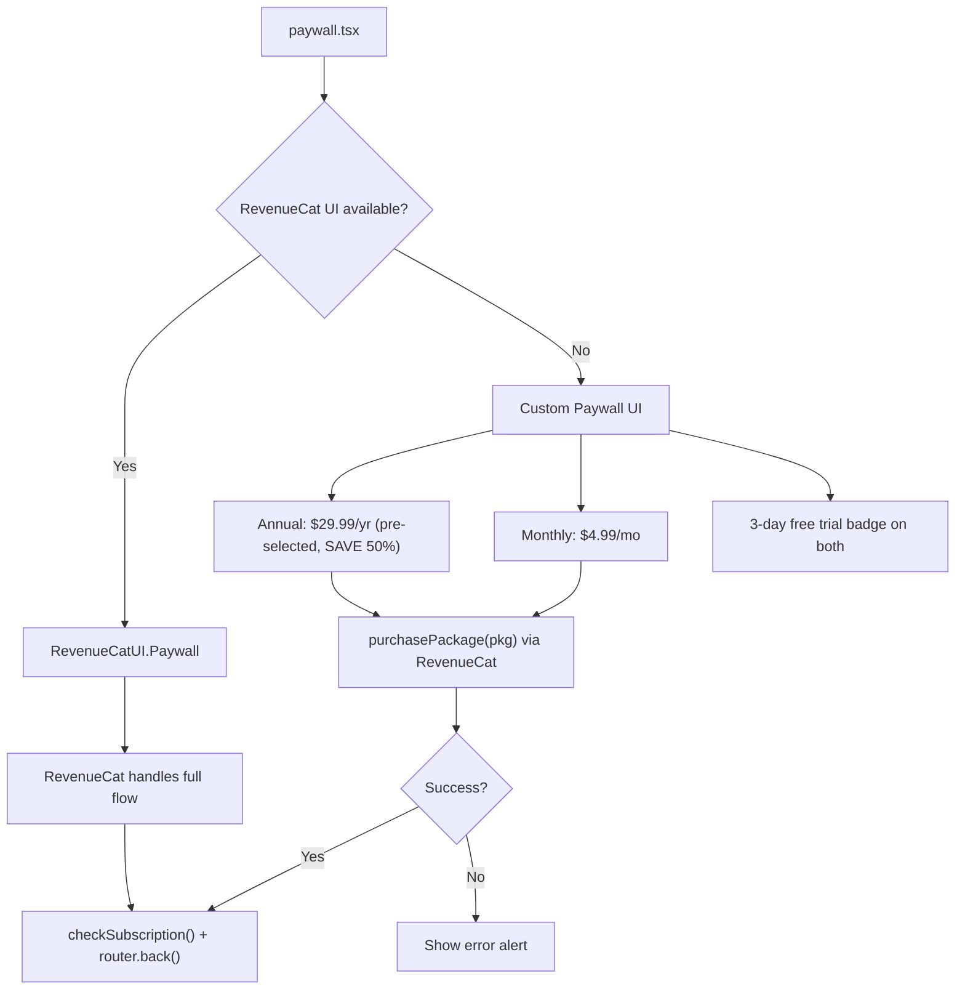
```mermaid
graph TD
    A["paywall.tsx"] --> B{RevenueCat UI available?}
    B -->|Yes| C[RevenueCatUI.Paywall]
    B -->|No| D[Custom Paywall UI]

    D --> E["Annual: $29.99/yr (pre-selected, SAVE 50%)"]
    D --> F["Monthly: $4.99/mo"]
    D --> G["3-day free trial badge on both"]

    E --> H["purchasePackage(pkg) via RevenueCat"]
    F --> H
    H --> I{Success?}
    I -->|Yes| J["checkSubscription() + router.back()"]
    I -->|No| K[Show error alert]

    C --> L[RevenueCat handles full flow]
    L --> J
```

**State**: `selectedPlan` ('annual' | 'monthly'), `packages`, `purchasing`, `restoring`, `error`, `loading`

**Pricing**: Annual $29.99/yr (pre-selected with "SAVE 50%"), Monthly $4.99/mo. 3-day free trial badge.

**Source param**: `?source=settings|insights|insights-chart|insights-wordcloud|insights-sentiment|insights-share|search` — for analytics tracking.

### Premium Features Listed

1. AI-Powered Mood Analysis
2. Word Cloud Visualization
3. Unlimited History
4. Full-Text Search
5. Shareable Mood Cards
6. Data Export

**Restore purchases**: `restorePurchases()` button at bottom.

---

## Settings Flow

### `app/(protected)/settings.tsx`

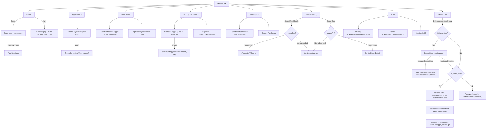
```mermaid
graph TD
    A["settings.tsx"] --> B[Profile]
    A --> C[Appearance]
    A --> D[Notifications]
    A --> E[Security / Biometrics]
    A --> F[Subscription]
    A --> G[Data & Sharing]
    A --> H[About]
    A --> I[Danger Zone]

    B -->|Guest| B1["Guest User / No account"]
    B1 -->|"Create Account"| B2["/(auth)/register"]
    B -->|Auth| B3["Email display + PRO badge if subscribed"]

    C --> C1["Theme: System / Light / Dark"]
    C1 -->|Select| C2["ThemeContext.setThemeMode()"]

    D --> D1["Push Notifications toggle (Coming Soon alert)"]
    D --> D2["/(protected)/notification-center"]

    E --> E1["Biometric toggle (Face ID / Touch ID)"]
    E1 -->|Toggle| E2["persistSetting('biometricEnabled', val)"]
    E --> E3["Sign Out → AuthContext.logout()"]

    F --> F1["/(protected)/paywall?source=settings"]
    F --> F2["Restore Purchases"]

    G -->|"Share Mood Cards"| G1{requirePro?}
    G1 -->|Subscribed| G2["/(protected)/sharing"]
    G1 -->|Not subscribed| G3["/(protected)/paywall"]

    G -->|"Export Data"| G4{requirePro?}
    G4 -->|Subscribed| G5["handleExportData()"]
    G4 -->|Not subscribed| G3

    H --> H1["Privacy: vexellabspro.com/daiyly/privacy"]
    H --> H2["Terms: vexellabspro.com/daiyly/terms"]
    H --> H3["Version: 1.0.0"]

    I -->|"Delete Account" auth only| I1{isSubscribed?}
    I1 -->|Yes| I2["Subscription warning alert"]
    I2 -->|"Manage Subscription"| I3["Open App Store/Play Store subscription management"]
    I2 -->|"Continue Deletion"| I4{is_apple_user?}
    I1 -->|No| I4
    I4 -->|Yes| I5["Apple re-auth → signInAsync() → get authorizationCode"]
    I5 --> I6["deleteAccount(undefined, authorizationCode)"]
    I6 --> I7["Backend revokes Apple token via apple_revoke.go"]
    I4 -->|No| I8["Password modal → deleteAccount(password)"]
```

### Export Data Flow (authenticated + subscribed)

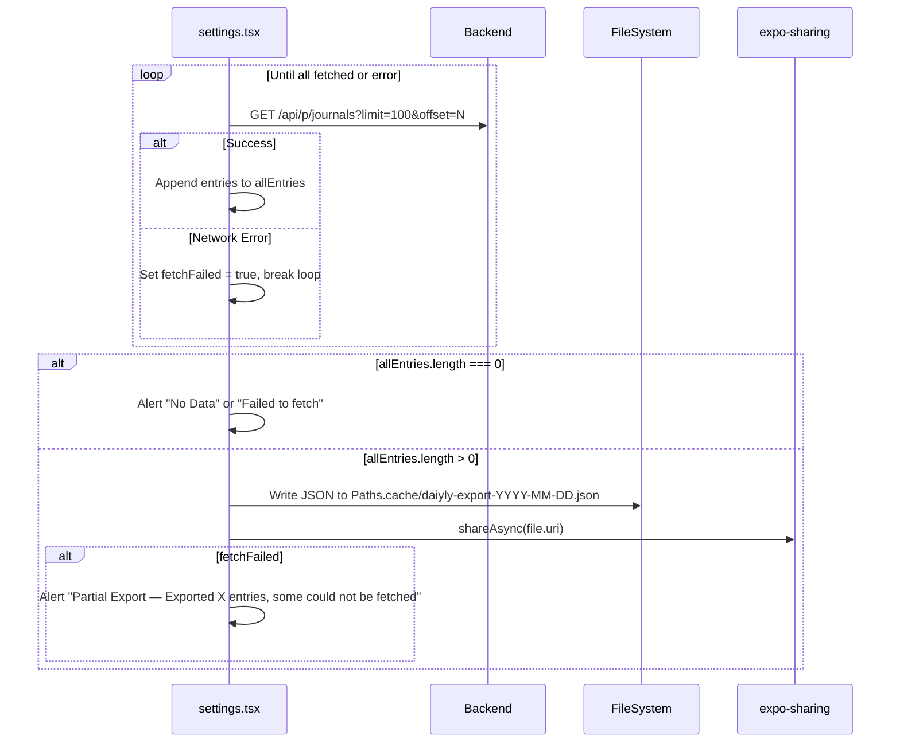
```mermaid
sequenceDiagram
    participant S as settings.tsx
    participant API as Backend
    participant FS as FileSystem
    participant Share as expo-sharing

    loop Until all fetched or error
        S->>API: GET /api/p/journals?limit=100&offset=N
        alt Success
            S->>S: Append entries to allEntries
        else Network Error
            S->>S: Set fetchFailed = true, break loop
        end
    end

    alt allEntries.length === 0
        S->>S: Alert "No Data" or "Failed to fetch"
    else allEntries.length > 0
        S->>FS: Write JSON to Paths.cache/daiyly-export-YYYY-MM-DD.json
        S->>Share: shareAsync(file.uri)
        alt fetchFailed
            S->>S: Alert "Partial Export — Exported X entries, some could not be fetched"
        end
    end
```

**Export resilience**: Each page fetch is wrapped in try/catch. On mid-export failure, exports whatever was collected so far and shows "Partial Export" alert with count. Only fails completely if zero pages were fetched.

**Guest**: No "Delete Account" section. Profile shows "Guest User / No account" with "Create Account" button. No "Sign Out" becomes available.

**Settings persistence**: `@daiyly_settings` key in AsyncStorage, JSON object with `biometricEnabled`, `notificationsEnabled`, and `themeMode`. This key is shared with `ThemeContext.tsx` which reads/writes `themeMode`.

---

## Notification Center Flow

### `app/(protected)/notification-center.tsx`

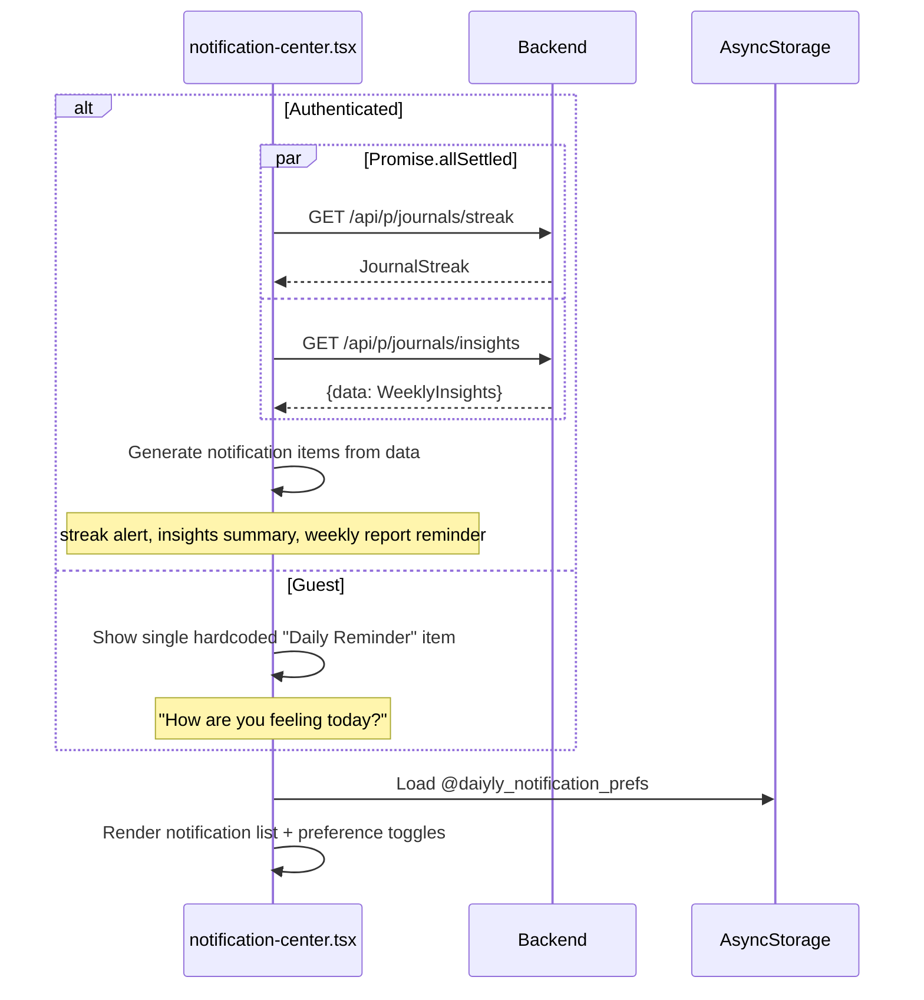
```mermaid
sequenceDiagram
    participant NC as notification-center.tsx
    participant API as Backend
    participant AS as AsyncStorage

    alt Authenticated
        par Promise.allSettled
            NC->>API: GET /api/p/journals/streak
            API-->>NC: JournalStreak
        and
            NC->>API: GET /api/p/journals/insights
            API-->>NC: {data: WeeklyInsights}
        end
        NC->>NC: Generate notification items from data
        Note over NC: streak alert, insights summary, weekly report reminder
    else Guest
        NC->>NC: Show single hardcoded "Daily Reminder" item
        Note over NC: "How are you feeling today?"
    end

    NC->>AS: Load @daiyly_notification_prefs
    NC->>NC: Render notification list + preference toggles
```

### Generated Notification Types

| Type | Condition | Message | Tap Action |
|------|-----------|---------|------------|
| `streak` | `current_streak > 0` | "You're on a {N}-day streak!" | → `/(protected)/new-entry` |
| `insight` | `average_mood_score > 0` | "Your average mood this week: {N}" | → `/(protected)/insights` |
| `weekly` | `total_entries > 0` | "Weekly summary available" | → `/(protected)/insights` |
| `reminder` | Always (guest or auth) | "How are you feeling today?" | → `/(protected)/new-entry` |

### Notification Preferences

```json
{
  "dailyReminder": true,
  "streakAlerts": true,
  "weeklyReports": true
}
```

Stored in `@daiyly_notification_prefs`. Toggle switches update immediately + persist.

### OS Permission Sync

The notification preference toggles are synced with the OS-level notification permission:

1. **On toggle ON**: Checks `Notifications.getPermissionsAsync()`. If not granted, calls `requestPermissionsAsync()` (triggers Android 13+ POST_NOTIFICATIONS runtime prompt). If still denied, shows platform-aware alert: Android gets specific instructions ("Settings > Apps > Daiyly > Notifications"), iOS gets generic "Open Settings". Toggle stays OFF.
2. **On app resume**: `AppState` listener re-checks OS permission status. If user revoked permission in Settings while app was backgrounded, shows red warning banner.
3. **On screen focus**: `useFocusEffect` from expo-router re-checks permission every time the Notification Center screen is focused. More reliable than AppState on Android where aggressive background kill may prevent the 'active' event from firing.
4. **Warning banner**: When OS permission is denied but local toggle preferences have any enabled, a red banner appears: "Notifications Blocked by System" with "Open Settings" link.

```mermaid
sequenceDiagram
    participant User
    participant NC as notification-center.tsx
    participant OS as Notifications API
    participant Settings as iOS Settings

    User->>NC: Toggle switch ON
    NC->>OS: getPermissionsAsync()
    alt Already granted
        NC->>NC: Update preference in AsyncStorage
    else Not granted
        NC->>OS: requestPermissionsAsync()
        alt User grants
            NC->>NC: Update preference in AsyncStorage
        else User denies
            NC->>NC: Show alert with "Open Settings" button
            User->>Settings: Opens iOS Settings
            Note over User,Settings: User toggles notification permission
            User->>NC: Returns to app (AppState 'active')
            NC->>OS: getPermissionsAsync() (re-check)
        end
    end
```

---

## Biometric Lock

### `app/(protected)/_layout.tsx`

```mermaid
graph TD
    A["_layout.tsx mounts"] --> B["AsyncStorage.getItem('@daiyly_settings')"]
    B --> C{Parse success?}
    C -->|Yes| D{settings.biometricEnabled?}
    D -->|Yes| E["authenticateWithBiometrics('Unlock Daiyly')"]
    E --> F{Success?}
    F -->|Yes| G["setIsUnlocked(true)"]
    F -->|No| H["setIsUnlocked(false) — show lock screen"]
    D -->|No| G
    C -->|No / Parse error| I["Assume biometric enabled (safe default)"]
    I --> E

    H --> J["Lock Screen: 'Daiyly is Locked'"]
    J --> K["Unlock button"]
    K --> E
```

**Safe default on corrupted settings**: If `@daiyly_settings` JSON is corrupted (parse throws), the app assumes biometric was enabled and attempts authentication. On auth failure, stays locked with retry button. This prevents bypass on corrupted data.

**Lock screen UI**: Lock icon, "Daiyly is Locked" title, "Authenticate to access your journal" subtitle, fingerprint "Unlock" button.

**iOS Face ID requirement**: `expo-local-authentication` must be listed in `app.json` plugins with `faceIDPermission` string. Without this, `NSFaceIDUsageDescription` is never added to Info.plist and iOS silently denies Face ID permission. Current config:
```json
["expo-local-authentication", {"faceIDPermission": "Allow Daiyly to use Face ID to unlock your journal."}]
```

---

## Offline Cache System

### `lib/cache.ts`

Simple write-through cache using AsyncStorage.

```typescript
// Write
cacheSet<T>(key: string, data: T): Promise<void>
// Stores: { data: T, cachedAt: ISO string }
// Key prefix: @daiyly_cache_

// Read
cacheGet<T>(key: string): Promise<CachedData<T> | null>
// Returns: { data: T, cachedAt: string } or null
```

### Cache Keys

| Key | Screen | Cached Data |
|-----|--------|-------------|
| `home_entries` | home.tsx | `DisplayEntry[]` (5 recent entries) |
| `home_streak` | home.tsx | `JournalStreak` |
| `history_entries` | history.tsx | `{entries: DisplayEntry[], total: number}` (first page) |
| `insights_data` | insights.tsx | `WeeklyInsights` |
| `insights_streak` | insights.tsx | `JournalStreak` |

### Cache Flow Pattern

```mermaid
graph TD
    A["Screen focuses"] --> B["API fetch"]
    B --> C{Success?}
    C -->|Yes| D["Set state + cacheSet(key, data)"]
    C -->|No| E["cacheGet(key)"]
    E --> F{Cache hit?}
    F -->|Yes| G["Set state from cache + setIsStale(true)"]
    G --> H["Show amber 'Showing cached data' banner"]
    F -->|No| I["Show error state / empty state"]
```

**Search offline fallback**: When search API fails, merges `history_entries` + `home_entries` caches (deduplicated by ID, up to 25 entries) and does local `content.includes(query)` filtering.

**Guest mode**: Does not use cache (uses AsyncStorage directly via `getGuestEntries()`).

---

## Token Refresh & Auth Expiry

### `lib/api.ts` — Axios Interceptors

```mermaid
sequenceDiagram
    participant App as Any Screen
    participant Axios as api instance
    participant API as Backend
    participant SS as SecureStore

    Note over Axios: Request interceptor
    Axios->>SS: getAccessToken()
    SS-->>Axios: token
    Axios->>Axios: Set Authorization: Bearer token
    Axios->>API: Original request

    API-->>Axios: 401 Unauthorized

    Note over Axios: Response interceptor
    alt isRefreshing === false
        Axios->>Axios: isRefreshing = true
        Axios->>SS: getRefreshToken()
        Axios->>API: POST /api/auth/refresh {refresh_token}
        alt Refresh success
            API-->>Axios: {access_token, refresh_token}
            Axios->>SS: setTokens(new access, new refresh)
            Axios->>Axios: processQueue(null, newToken)
            Axios->>API: Retry original request with new token
        else Refresh failure
            Axios->>Axios: processQueue(error, null)
            Axios->>SS: clearTokens()
            Axios->>Axios: emitAuthExpired()
            Note over Axios: AuthContext listener → setUser(null), redirect to login
        end
        Axios->>Axios: isRefreshing = false
    else isRefreshing === true
        Axios->>Axios: Push to failedQueue
        Note over Axios: Will be resolved when refresh completes
    end
```

**Mutex pattern**: `isRefreshing` flag + `failedQueue` array prevents concurrent refresh attempts. All 401'd requests queue up and get retried with new token.

**Auth expiry listener**: `onAuthExpired(callback)` registers listeners. AuthContext subscribes on mount, clears tokens + user on trigger.

### Remote Config URL Override

```mermaid
graph TD
    A["App start"] --> B["AsyncStorage: @fams_api_base_url"]
    B --> C{Cached URL?}
    C -->|Yes| D["_applyApiUrl(cached) — update baseURL"]
    C -->|No| E["Use hardcoded URL"]

    A --> F["refreshApiBaseUrl() fire-and-forget"]
    F --> G["GET /api/config"]
    G --> H{api_base_url in response?}
    H -->|Yes| I["_applyApiUrl(remote) + cache to AsyncStorage"]
    H -->|No| J["Keep current URL"]
```

---

## API Reference

### API Configuration

```
Base URL (protected): http://89.47.113.196:8099/api/p
Base URL (auth):      http://89.47.113.196:8099/api
Headers:              Content-Type: application/json
                      X-App-ID: daiyly
                      Authorization: Bearer <token>  (protected only)
Timeout:              15000ms
```

### Auth Endpoints (`/api`)

| Method | Endpoint | Request Body | Response |
|--------|----------|-------------|----------|
| `POST` | `/auth/login` | `{email, password}` | `{access_token, refresh_token, user: {id, email}}` |
| `POST` | `/auth/register` | `{email, password}` | `{access_token, refresh_token, user: {id, email}}` |
| `POST` | `/auth/apple` | `{identity_token, authorization_code, full_name?, email?}` | `{access_token, refresh_token, user: {id, email}}` |
| `POST` | `/auth/logout` | `{refresh_token}` | — |
| `POST` | `/auth/refresh` | `{refresh_token}` | `{access_token, refresh_token}` |
| `DELETE` | `/auth/account` | `{password, authorization_code?}` | — |
| `GET` | `/config` | — | `{api_base_url?: string, min_app_version?: string}` |

### Journal Endpoints (`/api/p`)

| Method | Endpoint | Request / Params | Response |
|--------|----------|-----------------|----------|
| `POST` | `/journals` | `{mood_emoji, mood_score, content, card_color, tags[], entry_date}` | `JournalEntry` |
| `GET` | `/journals` | `?offset=N&limit=N` | `{entries: JournalEntry[], total, limit, offset}` |
| `GET` | `/journals/:id` | — | `JournalEntry` (or `{data: JournalEntry}`) |
| `PUT` | `/journals/:id` | `{content, mood_score, mood_emoji, card_color}` | `JournalEntry` (or `{data: JournalEntry}`) |
| `DELETE` | `/journals/:id` | — | — |
| `GET` | `/journals/search` | `?q=string&limit=N&offset=N` | `{entries: JournalEntry[], total, hasMore}` |
| `GET` | `/journals/insights` | — | `{data: WeeklyInsights}` |
| `GET` | `/journals/weekly-report` | — | `WeeklyReport` (premium, AI) |
| `GET` | `/journals/streak` | — | `JournalStreak` |

---

## Data Types

### JournalEntry

```typescript
{
  id: string;
  user_id: string;
  mood_emoji: string;        // one of 8 emojis
  mood_score: number;        // 20, 40, 60, 80, or 100
  content: string;
  photo_url: string;         // DEAD FIELD — intentionally unused for MVP. Photo upload (compress, CDN, cache) deferred to v2.
  card_color: string;        // hex
  tags?: string[];           // activity tag IDs
  entry_date: string;        // "YYYY-MM-DD" (client local date)
  is_private: boolean;
  created_at: string;        // ISO datetime (UTC)
  updated_at: string;        // ISO datetime (UTC)
}
```

### JournalStreak

```typescript
{
  id: string;
  user_id: string;
  current_streak: number;
  longest_streak: number;
  total_entries: number;
  last_entry_date: string;   // ISO date
}
```

### WeeklyInsights

```typescript
{
  mood_trend: 'improving' | 'stable' | 'declining';
  average_mood_score: number;
  top_mood_emoji: string;
  mood_distribution: Array<{ emoji: string; count: number; percentage: number }>;
  daily_scores: Array<{ date: string; day_name: string; score: number }>;
  total_entries: number;
  avg_word_count: number;
  total_words: number;
  current_streak: number;
  longest_streak: number;
  period_start: string;
  period_end: string;
}
```

### WeeklyReport (Premium, AI-generated)

```typescript
{
  narrative: string;
  key_themes: string[];
  mood_explanation: string;
  suggestion: string;
  week_start: string;
  stats: {
    total_entries: number;
    avg_mood_score: number;
    top_mood_emoji: string;
  };
}
```

### GuestEntry

```typescript
{
  id: string;             // "guest_<timestamp>"
  mood_emoji: string;
  mood_score: number;
  content: string;
  card_color: string;
  tags?: string[];
  created_at: string;     // ISO datetime
  entry_date?: string;    // "YYYY-MM-DD" local date
}
```

### CachedData<T>

```typescript
{
  data: T;
  cachedAt: string;       // ISO datetime
}
```

### DraftData

```typescript
{
  selectedMood: string | null;
  moodScore: number;
  title: string;
  content: string;
  cardColor: string;
  selectedTags: string[];
  savedAt: string;        // ISO datetime
}
```

### User (`types/auth.ts`)

```typescript
{
  id: string;
  email: string;
  is_apple_user?: boolean;  // true if registered via Apple Sign-In
}
```

### AuthResponse (`types/auth.ts`)

```typescript
{
  access_token: string;
  refresh_token: string;
  user: User;
}
```

### JournalListResponse (`types/journal.ts`)

```typescript
{
  entries: JournalEntry[];
  total: number;
  limit: number;
  offset: number;
}
```

### MoodOption (`types/journal.ts`)

```typescript
{
  emoji: string;    // e.g. "😊"
  label: string;    // e.g. "Happy"
  color: string;    // hex e.g. "#22c55e"
  value: string;    // e.g. "happy"
}
```

### MOOD_OPTIONS constant (`types/journal.ts`)

8 mood options used throughout the app:

| Emoji | Label | Color | Value |
|-------|-------|-------|-------|
| 😊 | Happy | #22c55e | happy |
| 😌 | Calm | #06b6d4 | calm |
| 😔 | Sad | #6366f1 | sad |
| 😤 | Angry | #ef4444 | angry |
| 😰 | Anxious | #f59e0b | anxious |
| 😴 | Tired | #8b5cf6 | tired |
| 🥳 | Excited | #ec4899 | excited |
| 😐 | Neutral | #64748b | neutral |

---

## Guest vs Authenticated Matrix

| Feature | Guest | Authenticated |
|---------|-------|---------------|
| App entry point | `/(protected)/home` | `/(protected)/home` |
| Journal entries | Max 3, AsyncStorage | Unlimited, API |
| Entry edit | AsyncStorage update | `PUT /api/p/journals/:id` |
| Entry delete | AsyncStorage filter | `DELETE /api/p/journals/:id` |
| Entry share button | Hidden | Visible |
| History | All from AsyncStorage, no pagination | Paginated from API + cache |
| Insights | `computeGuestInsights()` locally | API: `/journals/insights` + cache |
| AI weekly report | Not available | Premium: `/journals/weekly-report` |
| Streak | Always 0 | API: `/journals/streak` |
| Search | Client-side string filter | API: `/journals/search` (offline: cache fallback) |
| Sharing | Uses local entries, streak=0 | Full API data |
| Export | Blocked by `requirePro()` | Premium: paginated API export (resilient) |
| Notification center | Single hardcoded reminder | API-derived notifications |
| Home banner | "Create a Free Account" | Not shown |
| History banner | Amber "sign up to sync" + "Local" badge | Not shown |
| Offline cache | N/A (always local) | Cache fallback with stale indicator |
| Settings profile | "Guest User / No account" + "Create Account" | Email display + PRO badge |
| Delete account | Not shown | `DELETE /auth/account` |
| Draft auto-save | Works (same mechanism) | Works (same mechanism) |
| Biometric lock | Works (same mechanism) | Works (same mechanism) |
| Migration on signup | Guest entries POSTed to API, guest data cleared | N/A |

---

## AsyncStorage Keys

| Key | Type | Purpose | Set By |
|-----|------|---------|--------|
| `guest_entries` | `GuestEntry[]` | Guest journal entries | `lib/guest.ts` |
| `guest_uses_count` | `string` (number) | Guest entry count (max 3) | `lib/guest.ts` |
| `@daiyly_settings` | `{biometricEnabled, notificationsEnabled, themeMode}` | App settings (shared by settings.tsx + ThemeContext.tsx) | `settings.tsx`, `ThemeContext.tsx` |
| `@daiyly_notification_prefs` | `{dailyReminder, streakAlerts, weeklyReports}` | Notification prefs | `notification-center.tsx` |
| `@daiyly_draft` | `DraftData` | New entry draft auto-save | `new-entry.tsx` |
| `@daiyly_cache_home_entries` | `CachedData<DisplayEntry[]>` | Home entries cache | `home.tsx` |
| `@daiyly_cache_home_streak` | `CachedData<JournalStreak>` | Home streak cache | `home.tsx` |
| `@daiyly_cache_history_entries` | `CachedData<{entries, total}>` | History first page cache | `history.tsx` |
| `@daiyly_cache_insights_data` | `CachedData<WeeklyInsights>` | Insights cache | `insights.tsx` |
| `@daiyly_cache_insights_streak` | `CachedData<JournalStreak>` | Insights streak cache | `insights.tsx` |
| `@fams_api_base_url` | `string` | Remote config URL override | `lib/api.ts` |
| `@daiyly_last_version_check` | `string` (timestamp) | Last force-update version check | `lib/version.ts` |
| `@daiyly_force_update_dismiss` | `string` (timestamp) | Temporary 1-hour force update dismiss | `ForceUpdateModal.tsx` |
| `@daiyly_review_state` | `ReviewState` | Review prompt state (count, entries, last prompted) | `lib/review.ts` |
| `@daiyly_language` | `string` | Selected language code (e.g. "en", "tr", "ar") | `lib/i18n.ts` |

| `@daiyly_onboarding_complete` | `"true"` | Whether user has seen onboarding | `lib/onboarding.ts` |

**SecureStore Keys** (encrypted, not AsyncStorage):

| Key | Type | Purpose | Set By |
|-----|------|---------|--------|
| `access_token` | `string` | JWT access token | `lib/storage.ts` |
| `refresh_token` | `string` | JWT refresh token | `lib/storage.ts` |

---

## Library Files Reference

### `lib/api.ts`
- Axios instance with `X-App-ID: daiyly` header
- Request interceptor: attaches Bearer token from SecureStore
- Response interceptor: auto-refresh on 401 with mutex + queue pattern
- `authApi` — separate instance for `/api` (auth/public) endpoints
- Remote config: `refreshApiBaseUrl()` fetches `/api/config`, caches URL override
- `getRemoteMinVersion()` — returns `min_app_version` from last config fetch (used by force update)

### `lib/guest.ts`
- `getGuestEntries()` — read from AsyncStorage
- `saveGuestEntry(entry)` — append to AsyncStorage
- `getGuestUsesCount()` / `incrementGuestUses()` / `hasGuestUsesRemaining()` — track 3-entry limit
- `clearGuestData()` — remove entries + count
- `migrateGuestEntries()` — POST each entry to API individually; removes only successfully migrated entries, keeps failures for retry

### `lib/cache.ts`
- `cacheSet<T>(key, data)` — write to `@daiyly_cache_{key}`
- `cacheGet<T>(key)` — read from `@daiyly_cache_{key}`
- Returns `{data: T, cachedAt: string}` or null

### `lib/storage.ts`
- `getAccessToken()` / `getRefreshToken()` — read from SecureStore
- `setTokens(access, refresh)` — write to SecureStore
- `clearTokens()` — remove from SecureStore

### `lib/purchases.ts`
- Safe RevenueCat wrapper with Expo Go fallback
- `getOfferings()`, `purchasePackage()`, `restorePurchases()`
- Returns mock data in Expo Go (no crash)

### `lib/useProGate.tsx`
- `requirePro(featureName, callback)` — checks subscription, shows paywall if not subscribed, calls callback if subscribed
- Used by settings.tsx for share + export features

### `lib/biometrics.ts`
- `isBiometricAvailable()` — checks hardware capability
- `getBiometricType()` — returns "Face ID" or "Touch ID"
- `authenticateWithBiometrics(reason)` — triggers system auth prompt

### `lib/haptics.ts`
- `hapticLight()`, `hapticMedium()`, `hapticSuccess()`, `hapticError()`, `hapticWarning()`, `hapticSelection()`
- Wraps expo-haptics for consistent feedback

### `lib/version.ts`
- `compareVersions(current, minimum)` — semver comparison, returns true if current >= minimum
- `getAppVersion()` — reads from `Constants.expoConfig.version`
- `shouldCheckVersion()` — throttles checks to every 6 hours via AsyncStorage
- `markVersionChecked()` — persists last check timestamp

### `lib/review.ts`
- `maybeRequestReview(trigger)` — checks availability, cooldown (90 days), max prompts (3 lifetime)
- `trackEntrySaved()` — increments entry counter, prompts at 5th/20th/50th entry
- Trigger types: `entry_saved` (from new-entry.tsx), `streak_milestone` (from home.tsx at 7/14/30/60/100)

### `lib/i18n.ts`
- Initializes `i18next` + `react-i18next` with 10 languages
- Supported: en, tr, de, fr, es, it, pt, ru, ar, zh
- `initLanguage()` — called by `_layout.tsx` on mount, reads saved language from AsyncStorage (`@daiyly_language`), falls back to device locale, then to English
- `changeLanguage(code)` — saves to AsyncStorage, changes i18n language, triggers `Updates.reloadAsync()` if switching to/from RTL (Arabic)
- `getCurrentLanguage()` — returns current i18n language code
- `getSupportedLanguages()` — returns `SupportedLanguage[]` with code, name, nativeName, isRTL
- `isRTL()` — returns `I18nManager.isRTL`
- Auto-initializes on module import (singleton promise pattern)

### `lib/onboarding.ts`
- Uses AsyncStorage — key: `@daiyly_onboarding_complete`
- `hasSeenOnboarding()` — reads AsyncStorage, returns boolean
- `setOnboardingSeen()` — writes `"true"` to AsyncStorage
- Called by `onboarding.tsx` (set) and `index.tsx` (check)

### `lib/cn.ts`
- `cn(...inputs)` — utility combining `clsx` + `tailwind-merge`
- Used by `Button.tsx` and `Input.tsx` for conditional className merging

### `contexts/AuthContext.tsx`
- Provides: `isAuthenticated`, `isGuest`, `isLoading`, `user`
- Methods: `login()`, `register()`, `loginWithApple()`, `logout()`, `deleteAccount()`, `enterGuestMode()`
- Auto-restores session from JWT on mount
- Calls `migrateGuestEntries()` after login/register/apple

### `contexts/ThemeContext.tsx`
- Provides: `isDark`, `themeMode`, `setThemeMode()`, `colorScheme`
- Modes: `system`, `light`, `dark`
- Uses `useColorScheme()` from `nativewind` (NOT `react-native`) to drive the NativeWind style engine
- `setColorScheme(mode)` updates `Appearance.setColorScheme()` which triggers `@media (prefers-color-scheme: dark)` in CSS
- Persists preference to `@daiyly_settings` in AsyncStorage
- Returns `null` until loaded (prevents flash of wrong theme)

### Dark Mode Architecture

**How it works (NativeWind v4)**:
1. `ThemeContext` calls `setColorScheme('dark' | 'light' | 'system')` from nativewind
2. NativeWind calls `Appearance.setColorScheme()` under the hood
3. This triggers `@media (prefers-color-scheme: dark)` in `global.css`, swapping CSS variable values
4. All components using semantic tokens (`bg-background`, `text-text-primary`, etc.) update instantly

**global.css**: Uses `@media (prefers-color-scheme: dark)` (NOT `.dark {}` — NativeWind bug #702). CSS variables use RGB triplets (`15 23 42`) for `<alpha-value>` opacity support.

**tailwind.config.js**: Colors defined as `rgb(var(--color-xxx) / <alpha-value>)`. Hardcoded hex colors (primary `#2563EB`, mood emojis, etc.) are fine for non-theme colors.

**Key constraint**: `darkMode: 'class'` in tailwind.config.js stays — it enables `dark:` utility class prefixes. The actual toggling happens via `@media` query + `Appearance.setColorScheme()`.

### `contexts/SubscriptionContext.tsx`
- Provides: `isSubscribed`, `isLoading`, `offerings`, `checkSubscription()`, `handlePurchase(pkg)`, `handleRestore()`, `refreshOfferings()`
- Wraps RevenueCat entitlement check ("premium")
- `offerings` — cached RevenueCat offerings (used by paywall.tsx to display packages)
- `handlePurchase(pkg)` — executes RevenueCat purchase flow for a specific package
- `refreshOfferings()` — re-fetches offerings from RevenueCat

---

## Force Update Mechanism

**Files**: `lib/version.ts`, `lib/api.ts`, `components/ForceUpdateModal.tsx`, `app/_layout.tsx`

### Flow

```mermaid
graph TD
    A[App Launch] --> B[refreshApiBaseUrl]
    B --> C{min_app_version in config?}
    C -->|No| D[Continue normally]
    C -->|Yes| E{shouldCheckVersion? 6h throttle}
    E -->|No, checked recently| D
    E -->|Yes| F{compareVersions current >= min?}
    F -->|Yes, OK| G[markVersionChecked]
    F -->|No, outdated| H[Show ForceUpdateModal]
    H --> I[User taps Update Now]
    I --> J[Opens App Store / Play Store]
    G --> D
```

### How it works

1. `refreshApiBaseUrl()` fetches `/api/config` which returns `min_app_version: "1.0.0"`
2. `api.ts` stores this in `_remoteMinVersion` module variable, exposed via `getRemoteMinVersion()`
3. `_layout.tsx` calls `compareVersions(getAppVersion(), minVersion)` after config fetch
4. Before showing modal, checks `wasRecentlyDismissed()` — if user dismissed within last hour, skips
5. If current version is below minimum, `ForceUpdateModal` renders — full-screen blocking modal
6. "Update Now" button opens the App Store listing via `Linking.openURL()`
7. After tapping "Update Now", a "Try again later" link appears (handles regional store propagation delays)
8. "Try again later" dismisses the modal for 1 hour (`@daiyly_force_update_dismiss` key) — modal re-appears on next app launch after cooldown
9. Version checks are throttled to every 6 hours via AsyncStorage

### Anti-zombie design

App Store updates can take up to 24 hours to propagate regionally. Without the temporary dismiss, users would be stuck in an infinite loop: modal → store → no update available → back to modal. The 1-hour dismiss window prevents this while still enforcing the update requirement.

### Admin control

Update minimum version via backend admin API:
```
PUT /api/admin/config/min_app_version
Authorization: Bearer <ADMIN_TOKEN>
Body: { "value": "1.1.0" }
```

---

## Deep Linking

**File**: `app.json`

### Configuration

```json
{
  "scheme": "daiyly",
  "ios": {
    "bundleIdentifier": "com.ahmetkizilkaya.daiyly",
    "associatedDomains": ["applinks:vexellabspro.com"]
  }
}
```

### Supported deep links

Expo Router auto-generates deep link handling from the file-based routing structure:

| Deep Link | Route File |
|-----------|-----------|
| `daiyly://home` | `app/(protected)/home.tsx` |
| `daiyly://new-entry` | `app/(protected)/new-entry.tsx` |
| `daiyly://entry/[id]` | `app/(protected)/entry/[id].tsx` |
| `daiyly://insights` | `app/(protected)/insights.tsx` |
| `daiyly://settings` | `app/(protected)/settings.tsx` |
| `daiyly://paywall` | `app/(protected)/paywall.tsx` |

All deep links respect the auth guard — unauthenticated users are redirected to login first.

### Cold start race condition handling

When the app is fully closed and a deep link triggers a cold start:

1. `(protected)/_layout.tsx` captures the initial URL via `Linking.getInitialURL()` on mount
2. While auth and biometrics load, the layout shows a spinner (deep link target is NOT rendered yet)
3. After auth resolves and biometric check passes, if there's a pending deep link, `router.replace()` navigates to it
4. This prevents the race where Router tries to render a protected route before auth is ready

The pending URL is stored in a `useRef` and consumed exactly once — no stale navigation risk.

---

## Store Review Prompts

**Files**: `lib/review.ts`, `app/(protected)/new-entry.tsx`, `app/(protected)/home.tsx`

### Trigger points

1. **Entry saved** (`new-entry.tsx`): After every successful journal save, `trackEntrySaved()` increments a counter. Prompts at the 5th, 20th, and 50th entry.
2. **Streak milestone** (`home.tsx`): When `current_streak` hits 7, 14, 30, 60, or 100, `maybeRequestReview('streak_milestone')` fires.

### Safety guards

| Guard | Value |
|-------|-------|
| Cooldown | 90 days between prompts |
| Lifetime max | 3 prompts total |
| Availability check | `StoreReview.isAvailableAsync()` — returns false in Expo Go |
| Failure mode | Silent — never blocks UX, all calls are fire-and-forget with `.catch(() => {})` |

### AsyncStorage key

`@daiyly_review_state` — stores `{ lastPromptedAt, totalEntries, promptCount }`

---

## Legal Compliance (Auth Screens)

**Files**: `app/(auth)/register.tsx`, `app/(auth)/login.tsx`

Both auth screens display legal links below the form:

> By continuing, you agree to our **Terms of Service** and **Privacy Policy**

- Terms: `https://vexellabspro.com/daiyly/terms`
- Privacy: `https://vexellabspro.com/daiyly/privacy`

Links open via `Linking.openURL()`. Required by Apple App Store Review Guidelines (5.1.1).

---

## Subscription Cancel Warning

**File**: `app/(protected)/settings.tsx`

### Flow (subscribed users)

```mermaid
graph TD
    A[Tap Delete Account] --> B[Alert: Are you sure? Permanent.]
    B -->|Cancel| Z[Abort]
    B -->|Delete| C{isSubscribed?}
    C -->|No| J{is_apple_user?}
    C -->|Yes| E[Alert: Active Subscription warning]
    E -->|Manage Subscription| F[Opens iOS/Android subscription settings]
    E -->|Continue Deletion| J
    E -->|Cancel| Z
    J -->|Yes| K[Apple re-auth via signInAsync]
    K -->|User cancels| Z
    K -->|Success| L[deleteAccount undefined, authorizationCode]
    L --> M[Backend revokes Apple token + deletes account]
    J -->|No| D[Show password modal]
    D --> G[Enter password]
    G --> H[deleteAccount password]
```

### Subscription management URLs

| Platform | URL |
|----------|-----|
| iOS | `https://apps.apple.com/account/subscriptions` |
| Android | `https://play.google.com/store/account/subscriptions` |

The warning is a 3-button Alert with "Manage Subscription" (opens store), "Continue Deletion" (destructive), and "Cancel".

### Apple Token Revocation on Account Delete

**Apple Guideline**: When a user deletes their account, the app must revoke their Apple Sign-In token so Apple stops associating the account.

**Implementation**:
- `AuthContext.deleteAccount(password?, authorizationCode?)` sends `authorization_code` in DELETE request body
- Backend's `apple_revoke.go` revokes the token with Apple's servers (fire-and-forget goroutine)
- For Apple users: settings.tsx calls `AppleAuthentication.signInAsync()` to get a fresh `authorizationCode` (Apple requires re-auth)
- For email users: standard password modal flow, no Apple revocation needed
- `User.is_apple_user` is set from JWT claims (`payload.is_apple_user`) and from API responses (`data.user.is_apple_user`)
- Backend JWT includes `is_apple_user: true/false` based on `user.AuthProvider == "apple"`

---

## Onboarding Flow

**File**: `app/onboarding.tsx`

### Trigger

Shown on first app launch when `hasSeenOnboarding()` returns false (reads `@daiyly_onboarding_complete` from AsyncStorage).

### Flow

```mermaid
graph TD
    A[App Launch] --> B{hasSeenOnboarding?}
    B -->|Yes| C[Route to auth or protected]
    B -->|No| D[Show Onboarding Carousel]
    D --> E[Page 0: Welcome]
    E --> F[Page 1: Features]
    F --> G[Page 2: Get Started]
    G --> H{User taps...}
    H -->|Get Started| I[router.replace auth/register]
    H -->|Try Free| J[enterGuestMode + setOnboardingSeen]
    J --> K[router.replace protected/home]
    D -->|Skip on pages 0-1| L[setOnboardingSeen]
    L --> M[router.replace auth/login]
    I --> L
```

### Implementation

- Horizontal `ScrollView` with `pagingEnabled` (3 pages)
- Each page: emoji icon, title, description
- "Skip" button visible on pages 0–1 → goes to login
- "Get Started" button on page 2 → goes to register
- "Try Free" button on page 2 → enters guest mode
- `setOnboardingSeen()` writes `"true"` to AsyncStorage key `@daiyly_onboarding_complete` (never shown again)

---

## Internationalization (i18n)

**Files**: `lib/i18n.ts`, `components/LanguageSwitcher.tsx`, `locales/*.json`

### Supported Languages (10)

| Code | Language | Native Name | RTL |
|------|----------|-------------|-----|
| en | English | English | No |
| tr | Turkish | Türkçe | No |
| de | German | Deutsch | No |
| fr | French | Français | No |
| es | Spanish | Español | No |
| it | Italian | Italiano | No |
| pt | Portuguese | Português | No |
| ru | Russian | Русский | No |
| ar | Arabic | العربية | Yes |
| zh | Chinese | 中文 | No |

### Flow

```mermaid
graph TD
    A[App Launch] --> B[initLanguage]
    B --> C{Saved language in AsyncStorage?}
    C -->|Yes| D[Use saved language]
    C -->|No| E[Detect device language]
    E --> F{Device language supported?}
    F -->|Yes| D2[Use device language]
    F -->|No| G[Fallback to English]
    D --> H[Initialize i18next]
    D2 --> H
    G --> H
    H --> I{Is RTL language?}
    I -->|Yes| J[I18nManager.forceRTL true]
    I -->|No| K[Continue normally]
```

### Language Change Flow

1. User opens Settings → taps Language
2. `LanguageSwitcher` modal opens (bottom sheet style)
3. User selects language → `changeLanguage(code)` called
4. Language saved to AsyncStorage (`@daiyly_language`)
5. `i18n.changeLanguage()` updates all `t()` calls immediately
6. If switching to/from RTL (Arabic): `I18nManager.forceRTL()` + `Updates.reloadAsync()` (full app reload required for RTL layout)

### AsyncStorage Key

`@daiyly_language` — stores the selected language code (e.g. `"en"`, `"ar"`)

### LanguageSwitcher Component

- Bottom-sheet modal with language list
- Shows native name + English name for each language
- RTL badge for Arabic (blue `bg-primary-100` badge)
- Checkmark on currently selected language (blue `#2563EB`)
- Loading spinner during language change
- Uses Daiyly's design tokens: `bg-surface-elevated`, `border-border`, `text-text-primary`, `text-primary`

---

## Components Reference

### `components/ErrorBoundary.tsx`

React class component wrapping the entire app tree (in `_layout.tsx`).

- Catches JavaScript errors in child component tree
- Reports to `Sentry.captureException()` with component stack
- Shows fallback UI: 😵 emoji + "Something went wrong" + "Try Again" button
- "Try Again" resets `hasError` state (re-renders children)
- Uses `useColorScheme()` for dark mode support in fallback screen
- Uses inline styles (not NativeWind) — class components can't use hooks directly, so a functional `ErrorFallback` wrapper handles theming

### `components/ForceUpdateModal.tsx`

Documented in [Force Update Mechanism](#force-update-mechanism).

### `components/LanguageSwitcher.tsx`

Documented in [Internationalization](#internationalization-i18n).

### `components/ui/Button.tsx`

Reusable button with variants and sizes.

| Prop | Type | Default | Description |
|------|------|---------|-------------|
| `title` | `string` | required | Button label |
| `variant` | `'primary' \| 'secondary' \| 'outline' \| 'destructive'` | `'primary'` | Visual style |
| `size` | `'sm' \| 'md' \| 'lg'` | `'md'` | Size preset |
| `isLoading` | `boolean` | `false` | Shows ActivityIndicator, disables press |

Uses `cn()` from `lib/cn.ts` for conditional className merging. Used in login.tsx, register.tsx, settings.tsx.

### `components/ui/Input.tsx`

Text input with label, error display, and focus ring.

| Prop | Type | Default | Description |
|------|------|---------|-------------|
| `label` | `string?` | — | Label text above input |
| `error` | `string?` | — | Error message below input (red) |

Uses `cn()` for conditional styling, `useTheme()` for dark mode placeholder color. Focus state toggles blue border. Used in login.tsx, register.tsx, settings.tsx.

### `components/ui/Modal.tsx`

Generic modal wrapper with backdrop dismiss.

| Prop | Type | Description |
|------|------|-------------|
| `visible` | `boolean` | Show/hide modal |
| `onClose` | `() => void` | Called on backdrop press or Android back |
| `title` | `string?` | Optional title at top |
| `children` | `ReactNode` | Modal content |

Transparent backdrop (black/50), centered card with rounded corners. Inner `Pressable` with `onPress={() => {}}` prevents backdrop dismiss when tapping content. Used in settings.tsx (delete account password modal).

### `components/ui/AppleSignInButton.tsx`

Apple Sign-In button with platform-specific rendering.

- **iOS**: Native `AppleAuthenticationButton` from `expo-apple-authentication`
- **Android**: Custom black button with Apple logo (Ionicons) as fallback
- Calls `loginWithApple()` from AuthContext with `identityToken`, `authorizationCode`, `fullName`, `email`
- Loading state support (external via `isLoading` prop or internal)
- Error callback via `onError` prop
- User cancel (`ERR_REQUEST_CANCELED`) silently ignored
- Haptic feedback: `hapticLight()` on press, `hapticError()` on failure

### `components/ui/CTABanner.tsx`

Gradient banner for upsell/achievement prompts.

**Two variants exported:**

1. `CTABanner` (default) — full gradient banner with icon, title, description, button, dismiss
   - Types: `upgrade` (amber), `feature` (purple-pink), `achievement` (green)
   - Uses `expo-linear-gradient` for gradient background
   - Optional dismiss button (`dismissible` prop)

2. `MinimalCTABanner` — flat blue banner with arrow
   - Simpler design, no gradient
   - Used for inline contextual prompts

Used in insights.tsx for premium upgrade banners.

### `components/ui/MoodCard.tsx`

**Three exports:**

1. `MoodCard` (default) — full mood display card with gradient background
   - Gradient colors based on mood label (5 tiers: Feeling Low → Amazing!)
   - Displays: emoji, mood score badge, label, formatted date, streak badge, share button, username
   - Uses `expo-linear-gradient`
   - `getMoodLabel(score)` helper: maps 0-100 score to human label

2. `ShareableMoodCard` — `forwardRef` card optimized for ViewShot capture
   - Fixed 320x400 dimensions for screenshot export
   - Includes decorative circles, branding, content excerpt
   - `collapsable={false}` for Android ViewShot compatibility

3. `MoodBentoGrid` — grid of emoji mood selectors
   - Wrap layout with 16x16 mood tiles
   - Used in mood selection flows

### `components/ui/ShareableResult.tsx`

**Two exports:**

1. `ShareableResult` (default) — Instagram Story optimized shareable card (9:16 aspect ratio)
   - ViewShot capture at 1080x1920 resolution
   - Gradient background with app branding
   - Built-in share flow: capture → copy to cache → `Sharing.shareAsync()`
   - Haptic feedback on share

2. `MinimalShareCard` — simple tap-to-share card
   - Plain background, centered value display
   - Same capture+share flow as ShareableResult

Both use `react-native-view-shot` + `expo-sharing` + `expo-file-system`.

---

## Types Reference

All TypeScript interfaces and constants are defined in `types/`:

### `types/auth.ts`

| Export | Type | Description |
|--------|------|-------------|
| `User` | interface | `{ id, email, is_apple_user? }` — user identity from JWT/API |
| `AuthResponse` | interface | `{ access_token, refresh_token, user }` — login/register response |
| `AuthState` | interface | `{ isAuthenticated, isLoading, user }` — auth context state |

### `types/journal.ts`

| Export | Type | Description |
|--------|------|-------------|
| `JournalEntry` | interface | Full journal entry shape (14 fields) |
| `JournalStreak` | interface | Streak data (current, longest, total, last date) |
| `JournalListResponse` | interface | Paginated response `{ entries, total, limit, offset }` |
| `WeeklyInsights` | interface | Stats: avg mood, trend, top mood, daily scores, total entries |
| `DailyScore` | interface | `{ date, score }` — single day's mood score |
| `WeeklyReport` | interface | AI report: narrative, themes, mood explanation, suggestion, stats |
| `GuestEntry` | interface | Subset of JournalEntry for local-only guest entries |
| `MoodOption` | interface | `{ emoji, label, color, value }` — mood selector option |
| `MOOD_OPTIONS` | const array | 8 mood options used throughout the app |

**Note**: `WeeklyInsights` in `types/journal.ts` has a simpler shape (`top_mood: string`) than what the backend returns and what `insights.tsx` uses inline (which includes `mood_distribution`, `writing_stats`, `streak_data`, `time_pattern`). The insights screen defines its own extended interface locally. The type file covers the base shape.

---

## Known Fixes & Notes

### Backend Route Fix (2026-02-25)

**Bug:** Backend registered all Daiyly journal routes as `/journal` (singular) in `unified-backend/internal/apps/daiyly/plugin.go`. Frontend calls `/journals` (plural). Every API call returned 404.

**Fix:** Changed all 14 route registrations from `/journal` to `/journals` in the backend. Frontend was already correct — no frontend changes needed. Deployed via Coolify.

### Migration Safety Fix (2026-02-25)

**Bug:** `migrateGuestEntries()` called `clearGuestData()` if `migrated > 0`, deleting ALL guest entries even if some failed to migrate.

**Fix:** Track migrated entry IDs in a Set. On partial success, remove only successfully migrated entries from AsyncStorage, keep failures for retry on next trigger. Full cleanup only when `migratedIds.size === guestEntries.length`.

### Search Offline Improvement (2026-02-25)

**Before:** Offline search fallback only searched `home_entries` cache (5 entries).

**After:** Merges `history_entries` cache (20 entries) + `home_entries` cache (5 entries), deduplicates by ID, searches up to 25 entries locally.

### Entry Date Timezone (Fixed)

**Problem:** Late-night entries (e.g., 11:30 PM PST) were assigned to the next UTC day because backend used `time.Now().UTC()` and ignored client's `entry_date`.

**Fix (Backend):** `CreateJournalRequest` now includes `EntryDate string` field. Backend parses `YYYY-MM-DD` from client:
- If valid and within sanity window (past 7 days to 1 day in future): uses client date
- If missing, invalid, or outside window: falls back to `time.Now().UTC()`
- Frontend already sends `entry_date: new Date().toISOString().split('T')[0]` (local calendar date)

**Sanity guard:** Rejects dates >7 days in the past or >1 day in the future to prevent clock manipulation while still allowing timezone differences (UTC+14 to UTC-12 = 26-hour spread).

### Dead Fields

| Field | Status | Rationale |
|-------|--------|-----------|
| `photo_url` | Dead (empty string) | Photo upload requires compress, CDN, cache — deferred to v2. MVP focuses on text journaling. |
| `is_private` | Dead (always false) | Social/sharing between users not yet implemented. Reserved for v2. |
